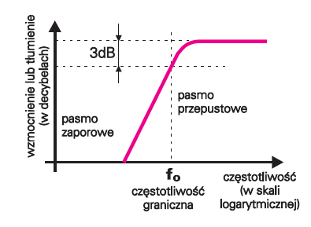
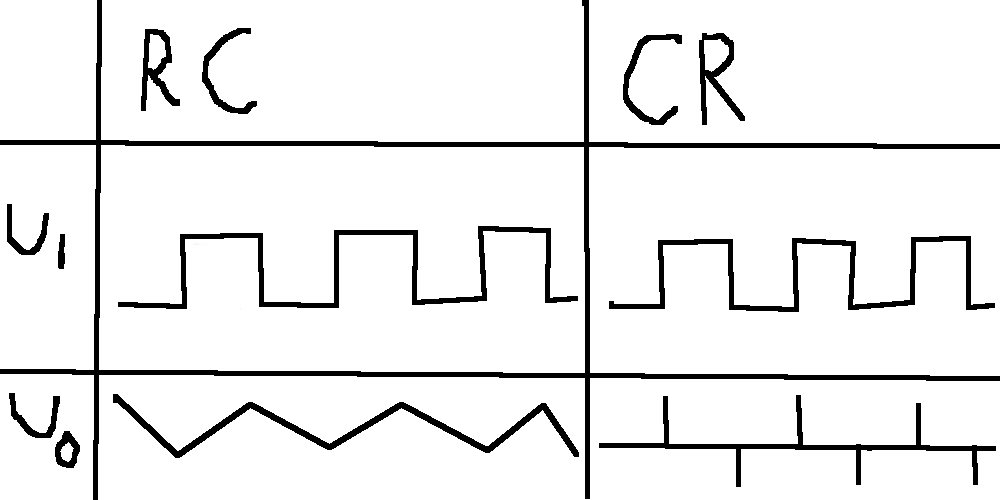
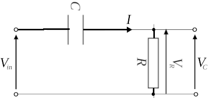
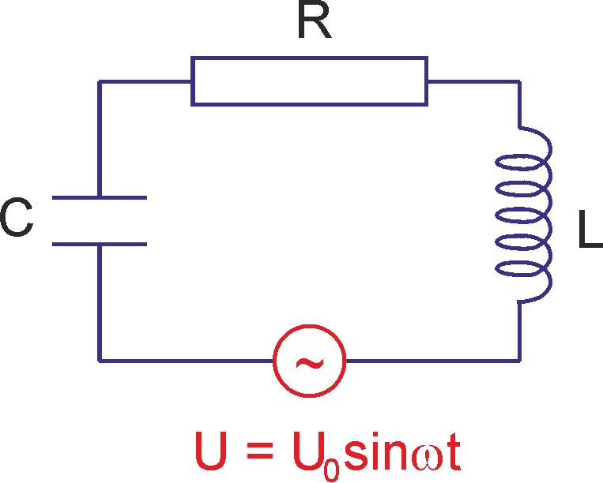
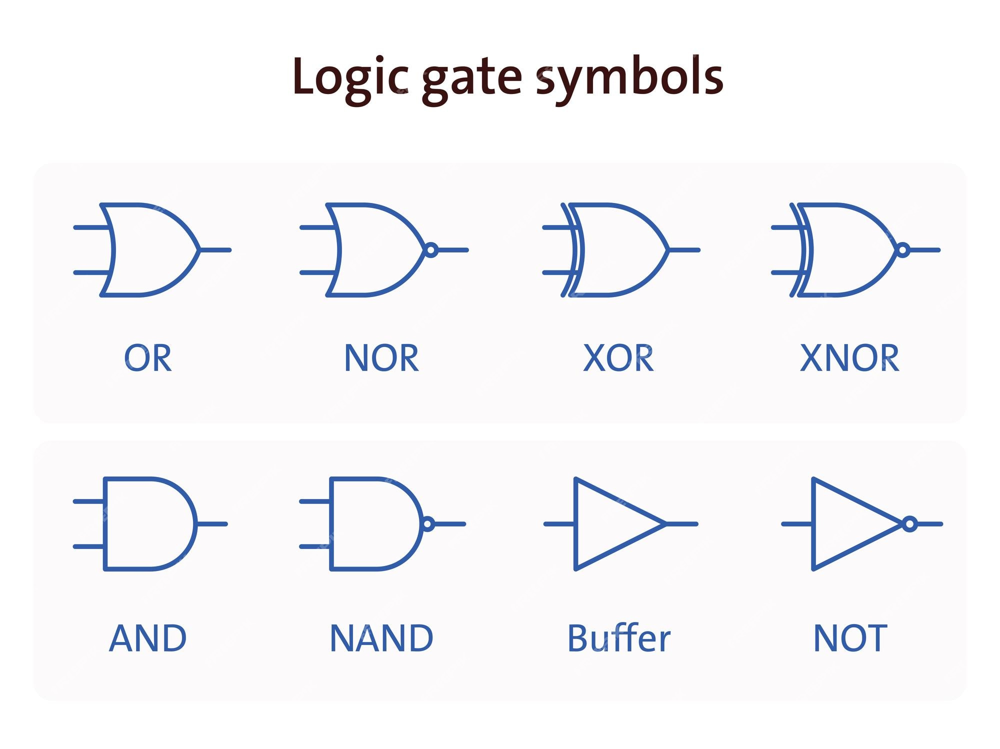
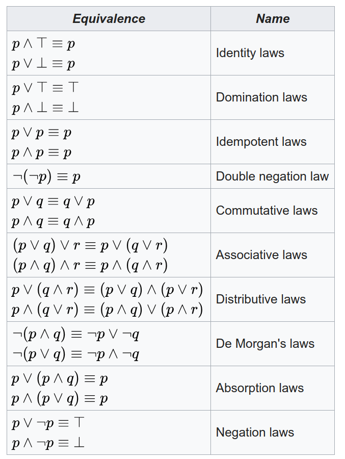

# Zagadnienia zaliczeniowe

## 1. Pojęcia podstawowe

### Ładunek
**Ładunek elektryczny** należy traktować jako dodatkową cechę materii, która pozwala mu na oddziaływanie z innymi ładunkami poprzez pole elektromagnetyczne. 
- Ładunek może mieć dwa przeciwne znaki: dodatni (+) i ujemny (-) decydujące o zwrocie oddziaływań
- **Ładunek dodatni** - proton
- **Ładunek ujemny** - elektron
- Ładunek jest skwantowany, to znaczy **może występować tylko w ściśle określonych porcjach będących wielokrotnością ładunku elementarnego elektronu e**.
- **Jednostka ładunku** - Kulomb (C) - ładunek elektryczny przenoszony przez prąd o natężeniu 1A w czasie 1s
- Całkowity ładunek elektryczny układu zamkniętego nie ulega zmianie

### Pole
**Pole elektryczne** to pole wektorowe określające w każdym punkcie **siłę działającą na jednostkowy, spoczywający ładunek elektryczny**. Pole elektryczne, niezależnie od układu ładunków, które je wytworzyły, można całkowicie zdefiniować, podając wartość natężenia pola $E(x, y, z)$ w każdym punkcie $(x, y, z)$ rozpatrywanego obszaru przestrzeni.
- Umieszczenie ładunku q w polu $\vec{E}$ powoduje powstanie siły $\vec{F}$
- **Natężenie pola elektrycznego**: $\vec{E} = \frac{\vec{F}}{q}$

### Prąd
**Prąd elektryczny** to uporządkowany ruch ładunków elektrycznych. Ilościowo prąd elektryczny najprościej określa się przez ustalenie **wielkości ładunku przepływającego w jednostce czasu przez jakąś wyodrębnioną powierzchnię**. Tak zdefiniowana wielkość nosi nazwę **natężenia prądu elektrycznego**, a **jej jednostka jest amper (1 A)**.
- Natężenie prądu stacjonarnego, czyli niezmiennego w czasie lub wielkość średnia natężenia prądu: $I=\frac{q}{t}$
- Natężenie prądu jako funkcja czasu: $i(t)=\frac{d}{dt}q(t)$

### Rezystancja
**Rezystancja** to opór, którego jednostką jest om (Ω)

### Potencjał
**Potencjał pola elektrycznego** w punkcie to **stosunek pracy W potrzebnej do przeniesienia ładunku q z tego punktu do nieskończoności**.
$$V = \frac{W}{q}$$
Jednostka potencjału jest 1 V (wolt) równy $\frac{1J}{1C}$ (dżulowi na kulomb).

### Napięcie
**Różnica potencjałów elektrycznych między dwoma punktami obwodu elektrycznego** lub pola elektrycznego. Napięcie elektryczne jest to **stosunek pracy wykonanej przeciwko polu, podczas przenoszenia ładunku elektrycznego między punktami, dla których określa się napięcie, do wartości tego ładunku**.
$$U_{AB} = V_B - V_A = \frac{W_{A \rightarrow B}}{q}$$
Jednostka napiecia jest V (Wolt)(Patrz: potencjał elektryczny).

### Praca i moc
**Praca** to miara ilości energii przekazywanej między układami fizycznymi.
- $W = U \cdot I \cdot t = q \cdot U$
- Jej jednostką jest J (dżul).

**Moc** to wielkość określająca pracę wykonaną w jednostce czasu przez układ fizyczny.
- $P=\frac{W}{t} = I \cdot U = I^2 \cdot R = \frac{U^2}{R}$
- Jej jednostką jest W (Wat).

## 2. Prawo Ohma
Prawo fizyki głoszące **proporcjonalność natężenia prądu płynącego przez przewodnik do napięcia panującego między końcami przewodnika**.
$$I(t) \sim U(t)$$
$$i(t) = \frac{1}{R}\cdot u(t)$$
$$I=\frac{U}{R}$$

- R to **rezystancja** (opór). Jej jednostką jest $\Omega$ (Ohm).
- Elementy, które spełniają prawo Ohma to **rezystory**. Nie wszystkie elementy elektroniczne spełniają prawo Ohma.

## 3. Prawa Kirchhoffa

### Prawo Kirchhoffa I (prądowe)
Suma natężeń prądów wpływających do węzła jest równa sumie natężeń prądów wypływających z tego węzła.

### Prawo Kirchhoffa II (napięciowe)
W zamkniętym obwodzie (oczku) suma spadków napięć równa jest sumie sił elektromotorycznych występujących w tym obwodzie.

## 4. Źródło napięciowe i prądowe

### Źródło napięciowe
Źródło dające stałą SEM (napięcie) niezależnie od obciążenia.
- Źródło idealne - nie uwzględnia np. rezystancji wewnętrznej
- Źródło rzeczywiste - bateria, zasilacz

### Źródło prądowe
Źródło dające stały prąd niezależnie od obciążenia.
- Źródło idealne - nie uwzględnia np. rezystancji wewnętrznej
- Źródło rzeczywiste - akumulator samochodowy

## 5. Siła elektromotoryczna
Gdyby do jednego końca przewodu podłączyć naładowane elektrycznie ciało, a do drugiego identyczne, ale z niedoborem ładunku, to prąd przez przewodnik płynąłby tylko do czasu osiągnięcia równowagi przy ciągłym zmniejszaniu się napięcia na jego końcach. Zatem **do utrzymania stałej różnicy potencjałów potrzebne są źródła napięcia**. 
- SEM to **zdolność źródła do wytwarzania różnicy potencjałów**.
- Jest mierzona w woltach i można ją traktować jako idealną różnicę potencjałów, którą źródło wytwarza, by wprowadzić elektrony w ruch.

## 6. Metoda oczkowa
**Metoda macierzowa umozliwiajaca wyznaczenie pradow plynacych przez kazda galaz oczka**
- uklad **N** rownan, gdzie **N** = liczba wezlow
- impedancje **wlasne** ($Z_{ii}$)
- impedancje **wzajemne** ($Z_{ij}$)
- prady **oczkowe**
- prady **galeziowe**

### Prawa Kirchhoffa
- **Z** - macierz impedancji wlasnych i wzajemnych
- **I** - prady plynace przez kazda galaz oczka
- **E** - wektor wymuszen
$$Z\cdot I = E$$
$$I=Z^{-1}\cdot E$$

### Impedancja wlasna
Impedancja wlasna $Z_{ii}$ dla obwodu, bez zrodel sterowanych, przy identycznym zwrocie pradow oczkowych, **jest rowna sumie wszystkich impedancji wystepujacych w oczku i**.

### Impedancja wzajemna
Impedancja wzajemna $Z_{ij}$ dla obwodu, bez zrodel sterowanych, przy identycznym zwrocie pradow oczkowych jest **rowna impedancji wspolnej dla oczek i oraz j wzietej ze znakiem minus**.

### Wektor wymuszen
i-ty element wektora wymuszen jest **rowny geometrycznej sumie wszystkich napiec zrodel w oczku.**

### Przyklad

- $Z = \begin{bmatrix} Z_1 + Z_2 + Z_3 & -Z_2 & -Z_3 \\ -Z_2 & Z_2 + Z_4 & -Z_4 \\ -Z_3 & -Z_4 & Z_3 + Z_4 \end{bmatrix}$
- $E = \begin{bmatrix} 0 \\ E_1 \\ -E_2 \end{bmatrix}$
- $I_1, I_2, I_3, I_4$ - prady galeziowe
- $I_{o_1}, I_{o_2}, I_{o_3}$ - prady oczkowe
- $I_1 = I_{o_1}, I_2 = I_{o_2} - I_{o_1}, I_3 = I_{o_3} - I_{o_1}, I_4 = I_{o_2} - I_{o_3}$

## 7. Zasada Thevenina
Stacjonarny, liniowy i skupiony **obwód elektryczny można zastąpić obwodem złożonym z idealnego źródła napięcia** (źródło Thevenina) **oraz impedancji** (rezystora w obwodach prądu stałego).

### Napiecie Thevenina
$$E_t = \frac{U}{R_1+R_2}\cdot R_2$$

### Prad Thevenina
Zastepuje zrodlo pradu rozwarciem
$$I_t = \frac{U}{R_1}$$

### Rezystancja Thevenina
Zastepuje zrodlo napiecia zwarciem
$$R_t=\frac{U_t}{I_t}$$
$$R_t=\frac{R_1\cdot R_2}{R_1+R_2}$$

## 8. Uogólnione prawo Ohma
Stany ustalone, **stałe DC** $\rightarrow$ pobudzenie **okresowe AC**
- Zespolony prąd jest proporcjonalny do zespolonego napięcia.
- $I=\frac{1}{Z}\cdot U$
- Z - impedancja

## 9. Impedancja
Uogólnienie koncepcji oporu elektrycznego dla **obwodów okresowych**.
$$Z=R+j\cdot X$$
- R - **rezystancja** (rezystory)
- X - **reaktancja** (kondensatory, indukcyjności)
- $j = \sqrt{-1}$

(**układ RC** $\uparrow$)

### Impedancja rezystora, kondensatora i indukcyjności
$$Z_R = R$$
$$Z_C = \frac{1}{j\omega C}$$
$$Z_L = j\omega L$$
**Wartość reaktancji pojemnościowej i indukcyjnej zależy od częstotliwości.** Reaktancja wprowadza przesunięcie fazowe między napięciem a prądem.

### Łączenie impedancji
**Szeregowe**
- $Z=\sum_i Z_i$ 
- $R=\sum_i R_i$, $C=\sum_i \frac{1}{C_i}$, $L=\sum_iL_i$

**Równoległe**
- $\frac{1}{Z}=\sum_i\frac{1}{Z_i}$
- $Y=\sum_iY_i$
- $R=\sum_i\frac{1}{R_i}$, $C=\sum_iC_i$, $L=\sum_i\frac{1}{L_i}$

## 10. Napięcie i częstotliwość w sieci energetycznej
**Napięcie sieciowe** – napięcie elektryczne występujące w sieci niskiego napięcia danego kraju. 
- **Napięcie sieciowe ma przebieg sinusoidalny** 
- w Polsce **napięcie 230  oraz częstotliwość 50 Hz** – określa to Polska Norma PN-IEC 60038. 
- Większość urządzeń powszechnego użytku jest zasilana z wykorzystaniem napięcia sieciowego lub napięciem przetworzonym z napięcia sieciowego, przy użyciu przekształtników napięcia.
- Wartość 230 V to **wartość skuteczna (RMS)** napięcia przemiennego
- Przy 230 V, **maksymalna wartość (amplituda) napięcia sieciowego wynosi** `230 V · √2 ≈ 230 V · (1,41) ≈ 325 V`
- **Wartość skuteczna napięcia międzyfazowego** wynosi `230 V · √3 ≈ 230 V · (1,73) ≈ 398 V ≈ 400 V`.
- **Wartość szczytowa napięcia międzyfazowego** wynosi `230 V · √2 · √3 ≈ 563 V`.
- Dopuszczalne odchylenia wynoszą obecnie ±10% z 230 V, czyli od 207 do 253 V dla 95% średnich wartości 10-minutowych okresów ze zbioru tygodniowego, co oznacza, że w ciągu tygodnia 5% średnich wartości 10-minutowych może wykraczać poza powyższy zakres.

## 11. Diody
**Dioda** to przyrzad polprzewodnikowy o charakterystyce **wykladniczej**. Nie dotyczy **Prawa Ohma**. Inaczej, Dioda to element półprzewodnikowy, który **przewodzi głównie w jednym kierunku** (po przekroczeniu tzw. **napięcia progowego**, zwykle ok. 0,6–0,7 V dla diody krzemowej).

### Dioda prostownicza
Dioda prostownicza to element półprzewodnikowy, który przewodzi prąd tylko w jednym kierunku (od anody do katody). Składa się z złącza p-n.
- **Polaryzacja przewodzenia**: anoda ma wyższy potencjał niż katoda → dioda przewodzi.
- **Polaryzacja zaporowa**: anoda ma niższy potencjał niż katoda → dioda nie przewodzi (poza niewielkim prądem upływu).

Dioda prostownicza:
- **Jednopołówkowa** – przewodzi tylko jedną połówkę sinusoidy (jedna dioda).
- **Dwupołówkowa** (np. układ mostkowy – **Graetz**): 4 diody w mostku, przewodzą obie połówki; daje pełniejszą konwersję na prąd stały.

**Charakterystyka prądowo-napięciowa**:
- W kierunku przewodzenia: po osiągnięciu napięcia progowego (~0,7 V dla krzemowej), prąd gwałtownie rośnie.
- W kierunku zaporowym: prąd prawie zerowy aż do przebicia.

Zwykle za prostownikiem stosuje się **filtr** (np. kondensator) do wygładzania tętnień.

### Dioda LED
Dioda LED emituje światło, gdy przewodzi prąd. Zbudowana jest również ze złącza p-n, ale z materiałów emitujących fotony przy rekombinacji nośników ładunku.
- **Polaryzacja przewodzenia**: przepływ prądu → emisja światła.
- **Polaryzacja zaporowa**: dioda nie świeci ani nie przewodzi.
- Występuje w wersjach kolorowych (czerwone, zielone, niebieskie, białe, UV) oraz np. **RGB** i **adresowalne RGB**.
- Typowe **napięcie przewodzenia** $U_f$​ ok. 2–3 V (zależnie od koloru).
- Prąd nominalny często ok. 10–20 mA (trzeba ograniczać rezystorem szeregowym).

### Tranzystor
**Tranzystor** - układ aktywny mogący **wzmacniać sygnał** elektryczny.
- wymaga **dodatkowego źródła zasilania** ($U_{cc}$)
- **Przełącznik**
- Model Ebersa-Molla
- Model małosygnałowy

**Tranzystor bipolarny**:
Struktura półprzewodnikowa złożona z dwóch złącz p-n.

- **Stan aktywny**: baza steruje przepływem prądu między kolektorem a emiterem.
- Mała zmiana prądu bazy → duża zmiana prądu kolektora (**wzmocnienie**).
- **Stan odcięcia** (cut-off): baza niepolaryzowana → brak przewodzenia.
- **Stan nasycenia**: baza silnie spolaryzowana → maksymalne przewodzenie.

Przy odpowiedniej polaryzacji złącz **BE**, **CE** i **CB** prąd **kolektora** ($I_C$) jest **proporcjonalny** do prądu **bazy** ($I_B$).
- $I_C=\beta\cdot I_B$
- $\beta \sim 100A/A$

**Niewielki prąd** płynący pomiędzy **bazą i emiterem** **steruje większym prądem** płynącym między **kolektorem i emiterem.**

## 12. Transmitancja i punkt 3dB

### Pasmo
**Zakres częstotliwości**, w którym **wzmocnienie układu spada o 3 dB** (tłumienie sygnału jest nie większe niż 3 dB).

Współczynnik nachylenia zbocza wynosi -20 dB na dekadę.

### Filtry
W paśmie przenoszenia sygnał nie ulega zmianie. W paśmie zaporowym sygnał jest tłumiony.
- filtr RC - całkowanie
- filtr CR - różniczkowanie

### Układ RC
Obwód elektryczny złożony z rezystora i kondensatora.

### Układ CR

### Układ RLC
Układ faworyzujący wąski przedział częstotliwości.
- Przebieg prostokątny = suma sinusoid
- Jeżeli $U_I$ to przebieg prostokątny, to $U_O$ to sinusoida w częstotliwości $\omega_0 = \sqrt{\frac{1}{L\cdot C}}$, która nie jest filtrowana przez obwód.

$$I=\frac{U}{R+j\omega L + \frac{1}{j\omega C}}=\frac{U}{R + j\cdot(\omega L - \frac{1}{\omega C})}$$

## 13. Algebra Boole'a
- Prawda/Fałsz
- AND/OR/NOT
- prawa algebry
- Fizyczna implementacja
	- TTL
	- CMOS
	- ...

### Konwencje zapisu działań
- **Koniunkcja** - iloczyn logiczny
    - $\wedge, \cdot, \&, AND$
- **Alternatywa** - suma logiczna
    - $\lor, \parallel, +, OR$
- **Negacja**
    - $\lnot, \sim, !, NOT$

###  Symbole bramek logicznych

### Prawa
- przemienność
- łączność
- rozdzielność
    - $A\&(B\parallel C)=(A\&B)\parallel(A\&C)$
- prawa de Morgan'a

### XOR
XOR przyjmuje 1 wtedy i tylko wtedy, gdy liczba elementów wejściowych równych 1 jest nieparzysta.

## 14. Systemy zapisu liczb
| System liczbowy    | Podstawa | Symbole cyfr    | Przykład liczby |
| ------------------ | -------- | --------------- | --------------- |
| Dziesiętny         | 10       | 0, 1, 2, ..., 9 | 125             |
| Binarny            | 2        | 0, 1            | 1111101         |
| Ósemkowy (oktalny) | 8        | 0–7             | 175             |
| Szesnastkowy       | 16       | 0–9, A–F        | 7D              |

### Sposoby przeliczania
| Z                    | Do                      | Metoda                     |
| -------------------- | ----------------------- | -------------------------- |
| Dziesiętny           | Binarny / Oktalny / Hex | Dzielenie przez podstawę   |
| Inne do dziesiętnego | Dziesiętny              | Mnożenie i potęgi podstawy |
| Binarny | Oktalny    | Grupowanie po 3 bity    |                            |
| Binarny | Hex        | Grupowanie po 4 bity    |                            |

## 15. Postać kanoniczna funkcji logicznej
$f(x_1, x_2) = \bar{x_1} \cdot \bar{x_2} \cdot f(\bar{x_1}, \bar{x_2}) +$
$\bar{x_1} \cdot x_2 \cdot f(\bar{x_1}, x_2) +$
$x_1 \cdot \bar{x_2} \cdot f(x_1, \bar{x_2}) +$
$x_1 \cdot x_2 \cdot f(x_1, x_2)$
Funkcja może mieć wiele równoważnych postaci.

## 16. Minimalizacja funkcji logicznej
Metody:
- Algebra Boole’a – upraszczanie wyrażeń za pomocą tożsamości logicznych.
    - Przykład: 
    - `f = AB + AB' → f = A(B + B') = A (ponieważ B + B' = 1)`
- Tablica Karnaugh (K-map) – graficzna metoda minimalizacji (patrz niżej).
- Algorytmy komputerowe (np. Quine-McCluskey) – dla większej liczby zmiennych.

### Tablica Karnaugh
Tablica Karnaugh to dwuwymiarowa siatka, która przedstawia wszystkie możliwe kombinacje wejść i pozwala znaleźć grupy „1" lub „0”, które można uprościć.

- Przykład: funkcja 2-zmienna f(A, B):
    - | A\B | 0 | 1 |
        | --- | - | - |
        | 0   | 0 | 1 |
        | 1   | 1 | 0 |
- Zaznacz 1 i twórz grupy potęg dwójki (1, 2, 4, 8...)
- Z każdej grupy wyprowadzasz jeden uproszczony składnik funkcji

W tym przypadku:

A'B = 1 i AB' = 1 → f = A'B + AB'

To jest funkcja XOR → f = A ⊕ B

## 17. Przerzutniki
**Przerzutnik** (ang. *flip-flop*) jest to układ sekwencyjny bistabilny (o dwóch stanach stabilnych), **zdolny do przechowywania 1 bitu informacji**. Przerzutnik może zmieniać swój stan pod wpływem sygnałów wejściowych, przy czym wyróżniamy przerzutniki: 
- *asynchroniczne* - bez sygnału zegarowego - stan wyjścia zmienia się natychmiast po zmianie wejścia
- *synchroniczne* - z wejściem zegarowym - zmiana stanu następuje tylko w określonym momencie taktującym. Wśród przerzutników synchronicznych dodatkowo rozróżnia się wyzwalanie:
	- *zboczem* - narastającym lub opadającym sygnału zegara
	- *poziomem* - stanem wysokim lub niskim sygnału zegara 

Każdy przerzutnik synchroniczny posiada zazwyczaj:
- **wejście zegarowe** (CLK)
- jedno lub więcej **wejść danych** (informacyjnych)
- **wyjście główne** Q
- często **wyjście zanegowane** $\overline{Q}$. 
- Często spotyka się również asynchroniczne wejścia **ustawiające** (Set) i **zerujące** (Reset), które mają najwyższy priorytet i natychmiast wymuszają na wyjściu stan 1 (dla Set) lub 0 (dla Reset), niezależnie od zegara.

### RS

**Przerzutnik RS (Set-Reset)** – jest to najprostszy rodzaj przerzutnika bistabilnego, zwykle realizowany jako latch asynchroniczny zbudowany z dwóch bramek NOR (lub równoważnie – z dwóch bramek NAND) sprzężonych zwrotnie. Posiada on dwa wejścia: $S$ (ang. *Set* – ustawiające) oraz $R$ (ang. *Reset* – zerujące), a także wyjście $Q$ i komplementarne $\overline{Q}$. Działanie przerzutnika RS podsumowuje tablica stanów:

|  S  |  R  |      $Q(t+1)$       |
| :-: | :-: | :-----------------: |
|  0  |  0  | $Q(t)$ (bez zmiany) |
|  0  |  1  |      0 (reset)      |
|  1  |  0  |       1 (set)       |
|  1  |  1  |  – *nieokreślony*   |

Przerzutnik RS **jako układ asynchroniczny zmienia stan wyjścia natychmiast po zmianie stanów wejść** (zakładając idealne bramki, pomijając niewielkie opóźnienia propagacji). Oznacza to, że nie posiada on dedykowanego wejścia zegarowego – jest wrażliwy na poziomy logiczne na $S$ i $R$ w każdym momencie. 

### Latch

**Przerzutnik T (toggle)** – przerzutnik, który przełącza swój stan przy każdym impulsie zegarowym, o ile na jego wejściu $T$ znajduje się stan wysoki (1). 
- Gdy $T=0$, przerzutnik T zachowuje swój bieżący stan niezmieniony. Można powiedzieć, że wejście $T$ kontroluje, czy przerzutnik ma *zmienić* stan (gdy $T=1$) czy *pozostać* w tym samym stanie (gdy $T=0$) w momencie wyzwolenia. 
- Tabela przejść przerzutnika T została już zaprezentowana wcześniej. Zgodnie z nią: 
    - jeżeli w chwili aktywnego zbocza zegara $Q(t)=0$ i $T=1$, to $Q(t+1)$ przyjmie stan 1
    - jeśli $Q(t)=1$ i $T=1$, to $Q(t+1)=0$ – następuje zmiana na przeciwny stan
- Matematycznie, $Q(t+1) = Q(t) \oplus T$, co oznacza sumę modulo 2 stanu wejścia i poprzedniego stanu wyjścia.

### D

**Przerzutnik D (Data lub Delay)** – jeden z najczęściej stosowanych typów przerzutników **synchronicznych**. 
- Posiada pojedyncze wejście danych $D$ oraz wejście zegarowe (oznaczane zwykle $C$ lub CLK). 
- Działanie przerzutnika D jest bardzo proste: **przepisuje on stan wejścia $D$ na wyjście $Q$ w momencie wystąpienia aktywnego zbocza sygnału zegarowego**, natomiast w pozostałych chwilach stan wyjścia pozostaje niezmieniony (zapamiętuje poprzednią wartość). 
- W przerzutniku D wyzwalanym zboczem narastającym – najbardziej typowym – oznacza to, że **przy każdym narastającym zboczu zegara aktualna wartość logiczna sygnału $D$ zostanie zapamiętana i pojawi się na $Q$,** pozostając tam do czasu kolejnego zbocza narastającego. 
- Tabela przejść przerzutnika D obrazuje, że następny stan $Q(t+1)$ jest po prostu równy wartości $D$ w chwili taktu, niezależnie od poprzedniego stanu $Q(t)$.
    - |  D  | Q(t) | Q(t+1) |
        | :-: | :--: | :----: |
        |  0  |   0  |    0   |
        |  0  |   1  |    0   |
        |  1  |   0  |    1   |
        |  1  |   1  |    1   |

Przerzutniki D występują w dwóch odmianach: 
- jako **zatrzaski (latch)** – reagujące na poziom zegara (np. zapisujące $D$ na $Q$ gdy sygnał zegarowy ma stan wysoki i zatrzaskujące ten stan przy niskim poziomie),
- oraz jako **przerzutniki wyzwalane zboczem** – reagujące tylko na krótką chwilę zmiany stanu zegara (zbocze narastające lub opadające). 

Przerzutnik D typu latch można przekształcić w przerzutnik D wyzwalany zboczem, łącząc dwa zatrzaski D w układ master-slave (pierwszy zatrzask próbkowany np. stanem wysokim zegara, drugi – niskim, przez co cały układ przepuszcza zmianę tylko podczas przejścia stanu). W praktyce jednak projektanci układów cyfrowych zazwyczaj korzystają bezpośrednio z gotowych przerzutników D wyzwalanych zboczem, dostępnych w rodzinach układów logicznych TTL/CMOS i w architekturach układów programowalnych.

## 18. Parametry konfiguracyjne interfejsu RS232C

## 19. Mikrokontroler a mikroprocesor