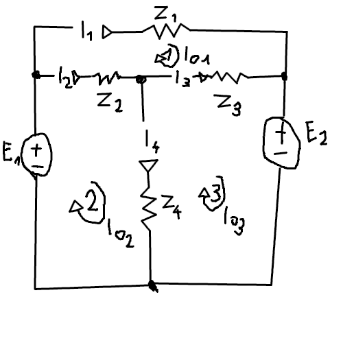

# Metoda oczkowa
**Metoda macierzowa umozliwiajaca wyznaczenie pradow plynacych przez kazda galaz oczka**
- uklad **N** rownan, gdzie **N** = liczba wezlow
- impedancje **wlasne** ($Z_{ii}$)
- impedancje **wzajemne** ($Z_{ij}$)
- prady **oczkowe**
- prady **galeziowe**

## Prawa Kirchhoffa
- **Z** - macierz impedancji wlasnych i wzajemnych
- **I** - prady plynace przez kazda galaz oczka
- **E** - wektor wymuszen
$$Z\cdot I = E$$
$$I=Z^{-1}\cdot E$$

## Impedancja wlasna
Impedancja wlasna $Z_{ii}$ dla obwodu, bez zrodel sterowanych, przy identycznym zwrocie pradow oczkowych, **jest rowna sumie wszystkich impedancji wystepujacych w oczku i**.

## Impedancja wzajemna
Impedancja wzajemna $Z_{ij}$ dla obwodu, bez zrodel sterowanych, przy identycznym zwrocie pradow oczkowych jest **rowna impedancji wspolnej dla oczek i oraz j wzietej ze znakiem minus**.

## Wektor wymuszen
i-ty element wektora wymuszen jest **rowny geometrycznej sumie wszystkich napiec zrodel w oczku.**

## Przyklad

$Z = \begin{bmatrix} Z_1 + Z_2 + Z_3 & -Z_2 & -Z_3 \\ -Z_2 & Z_2 + Z_4 & -Z_4 \\ -Z_3 & -Z_4 & Z_3 + Z_4 \end{bmatrix}$, $E = \begin{bmatrix} 0 \\ E_1 \\ -E_2 \end{bmatrix}$
$I_1, I_2, I_3, I_4$ - prady galeziowe, $I_{o_1}, I_{o_2}, I_{o_3}$ - prady oczkowe
$I_1 = I_{o_1}, I_2 = I_{o_2} - I_{o_1}, I_3 = I_{o_3} - I_{o_1}, I_4 = I_{o_2} - I_{o_3}$