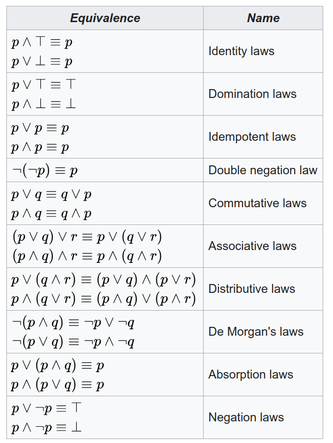
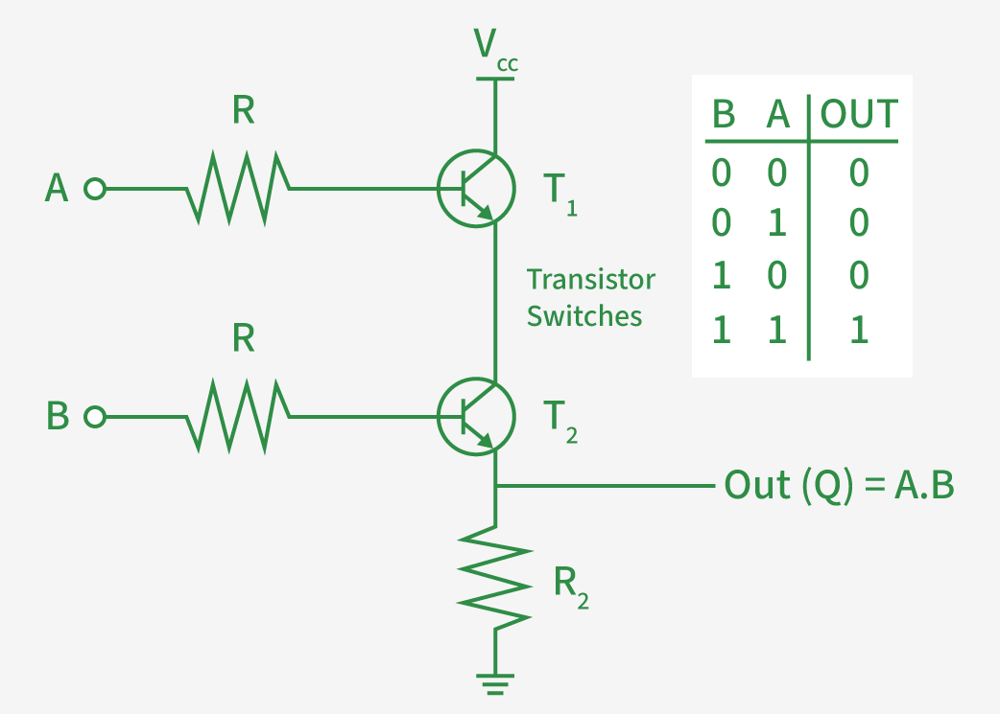
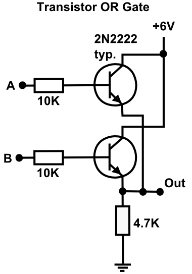
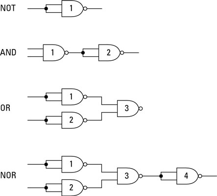

# Bramki
## Sygnały elektryczne
Analogowe
- napięcie
- temperatura
- ...
Cyfrowe
- otwarcie drzwi
- dzień/noc
- prawda/fałsz
- ...

## Układ cyfrowy
- Sygnały wejść {$x_i$}
- Sygnały wyjść {$y_i$}
- układ kombinacyjny
- układ sekwencyjny

##  Bramki logiczne
Układy realizujące podstawowe działania algebry Bool'a.
Przełączniki:
- elektromech.
- lampy próżniowe
- tranzystory
- układy scalone

## Algebra Bool'a
- Prawda/Fałsz
- AND/OR/NOT
- prawa algebry
- Fizyczna implementacja
	- TTL
	- CMOS
	- ...

## Konwencje zapisu działań
**Koniunkcja** - iloczyn logiczny
- $\wedge, \cdot, \&, AND$
**Alternatywa** - suma logiczna
- $\lor, \parallel, +, OR$
**Negacja**
- $\lnot, \sim, !, NOT$

##  Symbole bramek logicznych

## Prawa
- przemienność
- łączność
- rozdzielność $A\&(B\parallel C)=(A\&B)\parallel(A\&C)$
- prawa de Morgan'a

## AND

## OR

## Standardy napięć cyfrowych
- Standard TTL 74
	- zasilanie +5V
	- logiczne 0: 0..0.8V
	- logiczne 1: 2.4..5V
- Standard 3.3V
- Standard CMOS (CD4000)
## Praktyka
- **Wszystkie działania można zrealizować z bramek NAND.**
- Synteza funkcji logicznej
- Minimalizacja funkcji
- Bramki wielowyjściowe
- Gotowe bloki funkcjonalne MSI
- Seria TTL74, CMOS4k, itp
- PAL, PLA, GAL, CPLD, FPGA, ASIC

## Uniwersalna bramka NAND

## XOR
XOR przyjmuje 1 wtedy i tylko wtedy, gdy liczba elementów wejściowych równych 1 jest nieparzysta.