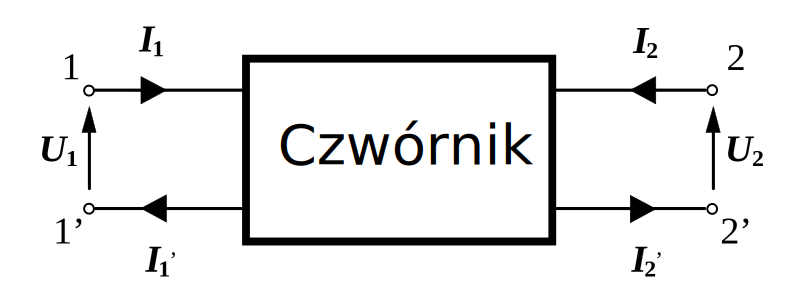

# Czwórniki

## Zasada Superpozycji
W obwodach **liniowych** odpowiedź (prąd, napięcie) na kilka źródeł jest sumą odpowiedzi uzyskanych osobno dla każdego źródła **(przy wyłączonych pozostałych)**
- Zrodla napieciowe -> zwarcie
- Zrodla pradowe -> rozwarcie

$$X_{E_1} \rightarrow I_3 \rightarrow I_{3_A}$$
$$X_{E_2} \rightarrow I_3 \rightarrow I_{3_B}$$
$$I_3 = I_{3_A} + I_{3_B}$$

## Definicja i zastosowanie
**Czwórnik** (układ dwuwejściowy i dwuwyjściowy) to obwód elektryczny/elektroniczny opisany czterema zaciskami: dwoma wejściowymi (wejście) i dwoma wyjściowymi (wyjście).

Umożliwia analizę oraz projektowanie układów w sposób uporządkowany – szczególnie we wzmacniaczach, filtrach czy liniach przesyłowych.

## Parametry czwórnika
Najczęściej opisuje się go za pomocą **parametrów typu Z, Y, H albo T** (macierze parametrów).
- $Z_{WE} = \frac{U_{WE}}{I_{WE}}$
- $Z_{WY} = \frac{U_{WY}}{I_{WY}}$
- $[\frac{U_{WE}}{U_{WY}}] = Z \cdot [\frac{I_{WE}}{I_{WY}}]$
- $[\frac{I_{WE}}{I_{WY}}] = Y \cdot [\frac{U_{WE}}{U_{WY}}]$

## Laczenie czwornikow
- **Kaskadowe**: $K = K_1  \cdot K_2$
- **Rownolegle**: $K = \frac{(K_1\cdot Z_{O2} + K_2\cdot Z_{O1})}{Z_{O1} + Z_{O2}}$
- **Szeregowe**
- **Rownoleglo-szeregowe**

## Impedancja czwornikow
- Impedancja wejsc: mozliwie duza
- Impedancja wyjsc: mozliwie mala
- Laczenie czwornikow: $Z_{WE} > 10 \cdot Z_{WY}$

## Bel, Decybel
**Bel (B)** – jednostka logarytmiczna; w praktyce używamy **decybeli (dB)**, bo 1 B = 10 dB.
- Stosujemy do wyrażania stosunku mocy czy napięcia:
- $B = log(\frac{P_{out}}{P_{in}})$, $1dB = \frac{1}{10}B$
- $\text{dB} = 10 \log_{10}\Bigl(\frac{P_{\text{out}}}{P_{\text{in}}}\Bigr)$, lub $\quad 20 \log_{10}\Bigl(\frac{U_{\text{out}}}{U_{\text{in}}}\Bigr)$.
- Dla prądu i napięcia wzmocnienie w dB to zwykle $20\log_{10}​$, a dla mocy – $10 \log_{10}$.

## **Wzmocnienie a decybele**
Dla czwórników, zwłaszcza wzmacniaczy, definiuje się **wzmocnienie napięciowe** $K_u = \frac{U_{wy}}{U_{we}}$.
- W **decybelach** (dB) liczymy je zwykle jako: $K_{\text{dB}} = 20 \log_{10}\!\Bigl(\frac{U_{wy}}{U_{we}}\Bigr)$
- Typowe wartości:
    - $K_u > 1 \rightarrow K_{dB} > 0$ (**wzmocnienie**).
    - $K_u = 1 \rightarrow K_{dB} = 0$
    - $K_u < 1 \rightarrow K_{dB} < 0$ (**tłumienie**).
$$\begin{bmatrix} K_u && K_{dB} \\ 1 && 0 \\ 10 && 20 \\ 100 && 40 \\ \frac{1}{10} && -20 \\ \frac{1}{\sqrt{2}} && -3 \end{bmatrix}$$