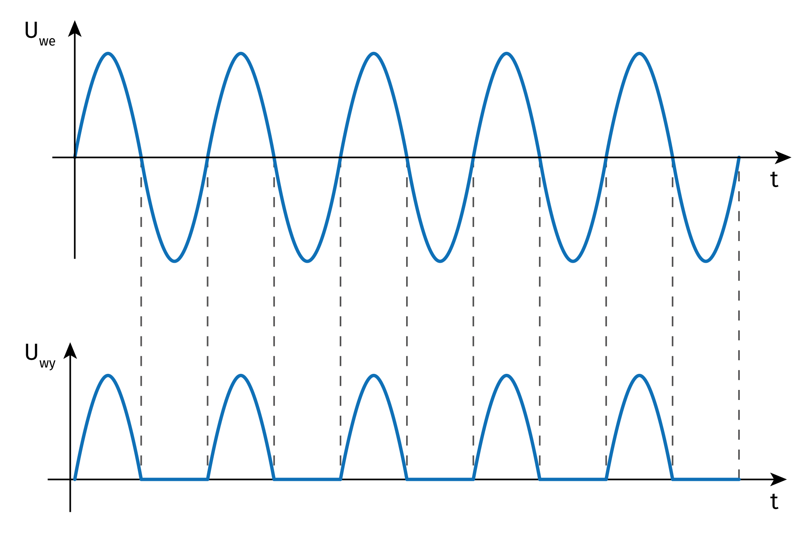

# Dioda
**Dioda** to przyrzad polprzewodnikowy o charakterystyce **wykladniczej**. Nie dotyczy **Prawa Ohma**. Inaczej, Dioda to element półprzewodnikowy, który **przewodzi głównie w jednym kierunku** (po przekroczeniu tzw. **napięcia progowego**, zwykle ok. 0,6–0,7 V dla diody krzemowej).

## Rodzaje diod
- **Prostownicze** – do zamiany prądu przemiennego (AC) na stały (DC).
- **Sygnałowe (małej mocy)** – do obwodów sygnałowych, przełączających, w pomiarach.
- **Zener** – stabilizatory napięcia, działa w kierunku zaporowym po przekroczeniu napięcia Zenera.
- **Pojemnościowe (tzw. warikapy)** – wykorzystywane w obwodach strojenia (zależność pojemności od przyłożonego napięcia).
- **LED (Light Emitting Diode)** – świecąca dioda półprzewodnikowa.

## Dioda prostownicza
- **Jednopołówkowa** – przewodzi tylko jedną połówkę sinusoidy (jedna dioda).
- **Dwupołówkowa** (np. układ mostkowy – **Graetz**): 4 diody w mostku, przewodzą obie połówki; daje pełniejszą konwersję na prąd stały.
- Zwykle za prostownikiem stosuje się **filtr** (np. kondensator) do wygładzania tętnień.

## Dioda LED
- Występuje w wersjach kolorowych (czerwone, zielone, niebieskie, białe, UV) oraz np. **RGB** i **adresowalne RGB**.
- Typowe napięcie przewodzenia $U_f$​ ok. 2–3 V (zależnie od koloru).
- Prąd nominalny często ok. 10–20 mA (trzeba ograniczać rezystorem szeregowym).