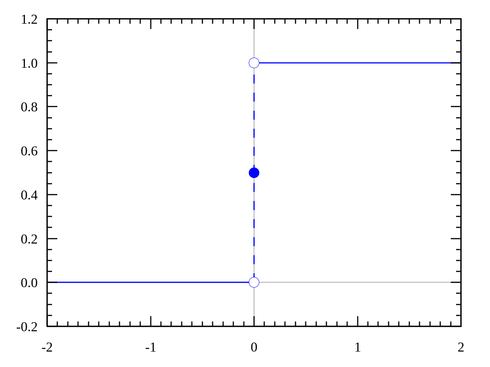
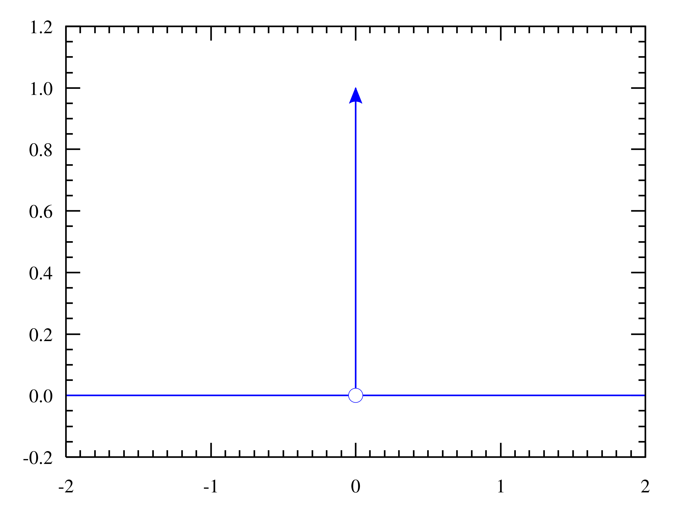

# Analiza obwodów AC
$\omega$ - częstotliwość kołowa. 
- $\omega = 2\pi \cdot f$ 
- $\frac{1}{s}$

f - częstotiwość (Hz)
t - okres 
- $t = \frac{1}{f}$
- s

$\phi$ - faza
- radian, kąt

## Rachunek symboliczny
Zamiana przebiegów czasowych na liczby zespolone. Zastąpienie chwilowych wartości prądów i napięć ich odpowiednikami w dziedzinie liczb zespolonych.
- $U(t)=U_o sin(\omega t + \phi)$ $U=U_o e^{j(\omega t + \phi)}$
- $I(t)=I_o sin(\omega t + \phi)$ $I=I_o e^{j(\omega t + \phi)}$

Prawdziwe wartości uzyskujemy mnożąc liczby zespolone przez $e^{j\omega t}$ i biorąc część rzeczywistą.

## Symbol Eulera
- $e^{jw}=cos{\omega} + j \cdot sin(\omega)$
- $e^{j90} = j$ $j = \sqrt{-1}$

## Uogólnione prawo Ohma
- Stany ustalone, **stałe DC** $\rightarrow$ pobudzenie **okresowe AC**
- Zespolony prąd jest proporcjonalny do zespolonego napięcia.
- $I=\frac{1}{Z}\cdot U$
- Z - impedancja

## Analiza obwodów AC
Analiza w dziedzinie czasu.
- U(t), I(t), R(t)
- pobudzenie uskokiem jednostkowym
Analiza w dziedzinie częstotliwości.
- $U(\omega), I(\omega), Z(\omega)$
- pobudzenie sygnałem sinusoidalnym

## Sygnały

### Sygnał sinusoidalny
$Y=A\cdot sin(\omega\cdot t + \phi)$
- A - amplituda
- $\omega$ - częstotliwość kołowa
- t - okres
- $\phi$ - faza

### Uskok jednostkowy
- y(t) = 0 dla t <0
- y(t) = 1 dla t > 0

### Impuls Diraca

