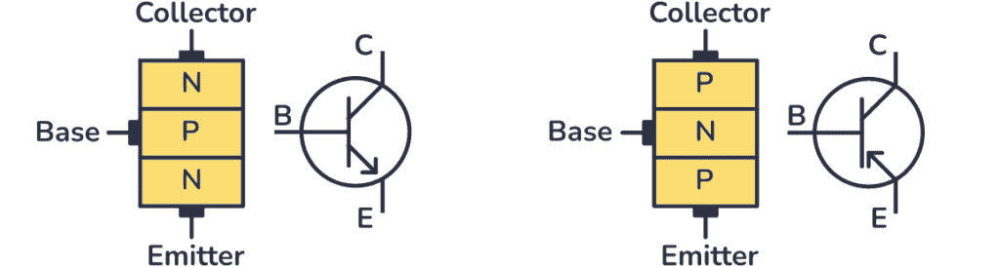
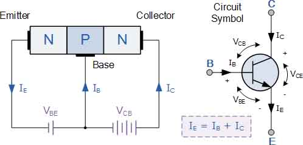
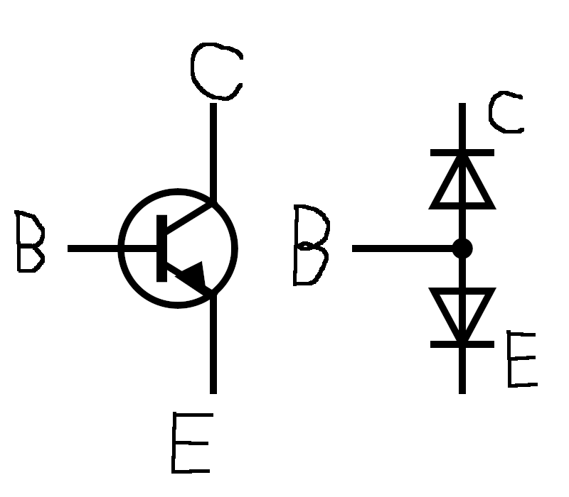
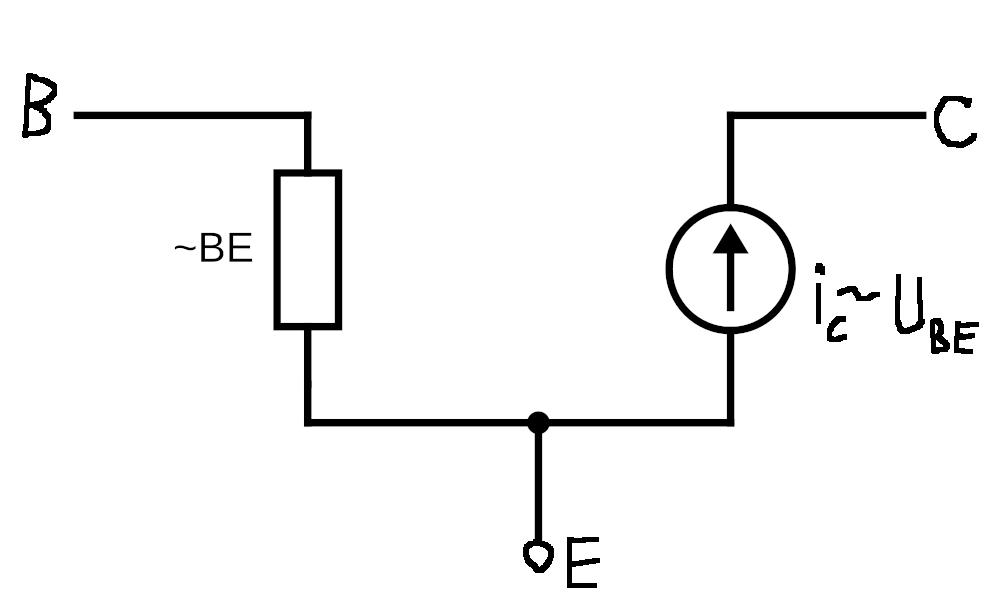
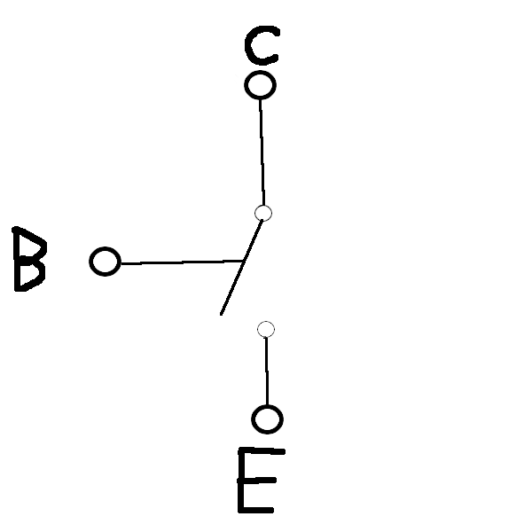
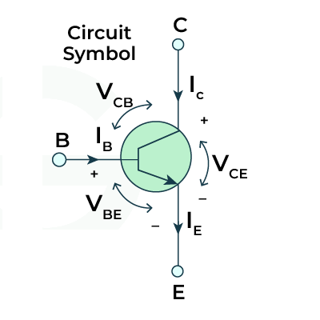
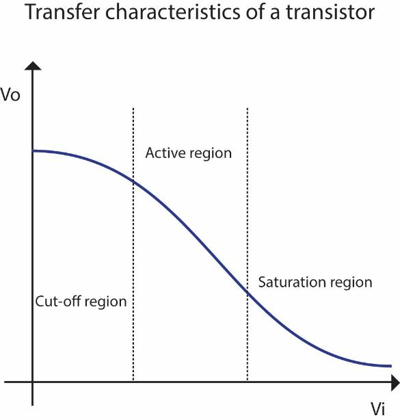
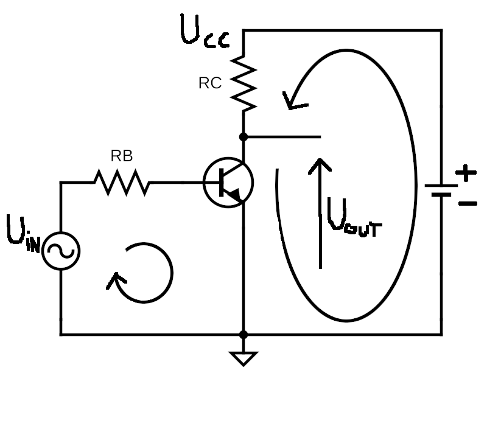

# Tranzystor
**Tranzystor** - układ aktywny mogący **wzmacniać sygnał** elektryczny.
- wymaga **dodatkowego źródła zasilania** ($U_{cc}$)
- **Przełącznik**
- Model Ebersa-Molla
- Model małosygnałowy

## Rodzaje tranzystorów
- **Bipolarne**
	- npn
	- pnp
- **Polowe** (FET)
	- MOSFET
	- NMOS
	- PMOS
	- ...

## Wyprowadzenia

### Tranzystory bipolarne
- B - **baza**
- E - **emiter**
- C - **kolektor**

### Tranzystory unipolarne (polowe)
- S - **źródło**
- D - **dren**
- G - **bramka**

# Tranzystor Bipolarny
Struktura półprzewodnikowa złożona z dwóch złącz p-n.

## Zasada działania
Przy odpowiedniej polaryzacji złącz **BE**, **CE** i **CB** prąd **kolektora** ($I_C$) jest **proporcjonalny** do prądu **bazy** ($I_B$).
- $I_C=\beta\cdot I_B$
- $\beta \sim 100A/A$

**Niewielki prąd** płynący pomiędzy **bazą i emiterem** **steruje większym prądem** płynącym między **kolektorem i emiterem.**
W przypadku tranzystorów polowych, napięcie przyłożone do bramki zmienia przewodnictwo kanału, wpływając w ten sposób na płynący prąd.
## Złącza

## Model małosygnałowy

## Tranzystor jako przełącznik

## Polaryzacja tranzystora npn

## Obszary pracy tranzystora
- Odcięcie
- Obszar aktywny
- Nasycenie

### Obszar aktywny
Tranzystor działa jak **wzmacniacz**. $I_C=\beta \cdot I_B$
- **Złącze B-E**
	- kierunek przewodzenia
	- $U_{BE} = 0.6V$
- **Złącze B-C**
	- kierunek zaporowy
- Prąd C jest proporcjonalny do prądu B
- Wzmacniacze liniowe

### Odcięcie
Tranzystor jest całkowicie **wyłączony**. (przełącznik)
- $U_{BE}=0V$
- $I_B=0$
- $I_C=0$
- $U_{CE}=U_{CC}$

### Nasycenie
Tranzystor jest w pełni **włączony**. (przełącznik)
- $U_{BE}=0.6V$
- $I_B = \text{odp. duży}$
- $I_C = \text{max, niezależny od }I_B$
- $U_{CE} \sim 0$

## Zależności prądowe (obszar aktywny)
- $I_E=I_C + I_B$
- $I_C = \beta\cdot I_B$
- $I_E = \alpha\cdot I_C$
- $\beta > 100$, $\alpha \sim 1$

$V_O=V_C$, $V_{i} \sim V_B$

## Ograniczenia
W praktyce parametry tranzystora zależą między innymi od temperatury.

## Podstawowy układ pracy

## Punkt pracy

## Równanie oczkowe DC i AC

## Układy cyfrowe

### Inwerter tranzystorowy

### NOR

### NAND

### Źródło prądowe

### Sterowanie przekaźnikiem

### Mostek H

## Układy analogowe

### Wtórnik emiterowy

### Dioda Zenera i wtórnik w zasilaczu

### Układ wspólny emitera (koncepcja)

### Klucz analogowy

### Konwerter 5V <-> 3.3V