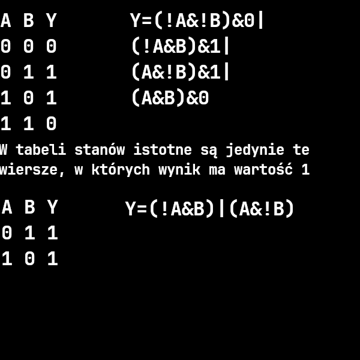

# Układy kombinacyjne
Układ, w którym stan wyjściowy Y zależy jedynie od stanu wejściowego X w danej chwili.
- Układy cyfrowe
	- **Układy kombinacyjne**
	- Układy sekwencyjne
		- asynchroniczne
		- synchroniczne

Skończona ilość stanów wejściowych {$X_i$}
Skończona ilość stanów wyjściowych {$Y_i$}
Rozbicie na proste funkcje.

## Zapis funkcji logicznej
- słowny
- tabele stanów
- postać kanoniczna
- zapis matematyczny
- schemat elektryczny
- VHDL

### Stany  wejściowe
Stany wejściowe jako kombinacje 0 i 1 wygodnie jest numerować jako liczby zapisane w kodzie binarnym.

### Postać kanoniczna kombinacyjnej funkcji logicznej
$f(x_1, x_2) = \bar{x_1} \cdot \bar{x_2} \cdot f(\bar{x_1}, \bar{x_2}) +$
$\bar{x_1} \cdot x_2 \cdot f(\bar{x_1}, x_2) +$
$x_1 \cdot \bar{x_2} \cdot f(x_1, \bar{x_2}) +$
$x_1 \cdot x_2 \cdot f(x_1, x_2)$
Funkcja może mieć wiele równoważnych postaci.
Minimalizacja:
- tablica Karnaugh dla 3, 4 argumentów
- ...
- realizacja zwykle z NAND

### Schemat połączeń
- Duży, porządny rysunek
- Linie w pionie
	- wejścia i zanegowane wejścia
- Linie w poziomie (w prawo)
	- połączenia wejść
- Punkty połączeń

## Minimalizacja funkcji
- $(A\&B)|(A\&(!B))\rightarrow A$
- tablica Karnaugh'a

### Tablica Karnaugh'a
https://pl.wikipedia.org/wiki/Metoda_Karnaugha

## Hazard
Zwykle ujawnia się przy wysokich częstotliwościach. Skrócony czas propagacji sygnału przez bramki.

## Układy PLD
- Programowalna matryca AND
	- nie programowalna matryca OR
- Plik z realizowaną funkcją logiczną
- Kompilator

## Układy kombinacyjne MSI
Medium-scale-integration
- Dekoder
- Sumator
- Multiplekser
- Demultiplekser
- ALU

### Dekoder
Układ zamieniający binarną postać informacji
- dekoder BIN <-> 1 z N
- dekoder 1 z N <-> BIN
- BIN <-> BCD
- wskaźnik 7-segmentowy

### Sumator
Układ umożliwiający dodawanie liczb całkowitych w postaci binarnej.
- liczba całkowita bez znaku
- pół sumator, pełny sumator

### Komparator
Układ umożliwiający porównywanie liczb.

### Multiplekser
Układ spełniający funkcję przełącznika.
- wejście informacyjne
- wejście adresowe
- wyjście

### Demultiplekser

### ALU
Układ umożliwiający wykonywanie działań arytmetycznych.