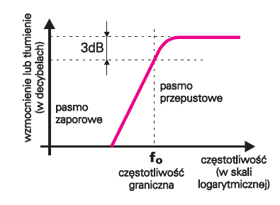
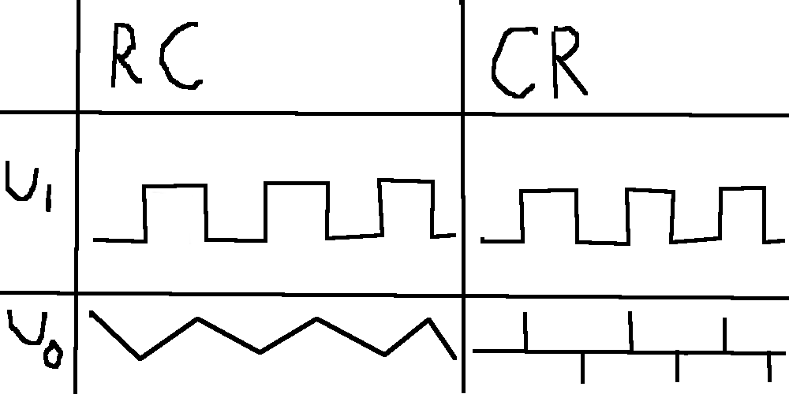
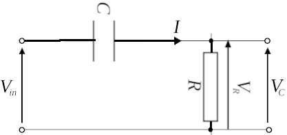
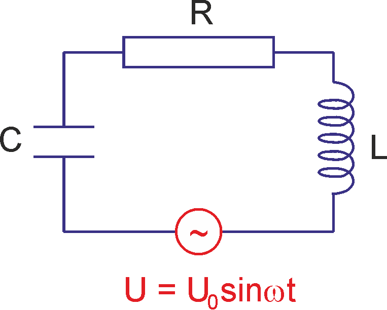

# Pasmo
**Zakres częstotliwości**, w którym **wzmocnienie układu spada o 3 dB** (tłumienie sygnału jest nie większe niż 3 dB).

Współczynnik nachylenia zbocza wynosi -20 dB na dekadę.

# Filtry
W paśmie przenoszenia sygnał nie ulega zmianie. W paśmie zaporowym sygnał jest tłumiony.
- filtr RC - całkowanie
- filtr CR - różniczkowanie

# Układ RC
Obwód elektryczny złożony z rezystora i kondensatora.

# Układ CR

# Układ RLC
Układ faworyzujący wąski przedział częstotliwości.
- Przebieg prostokątny = suma sinusoid
- Jeżeli $U_I$ to przebieg prostokątny, to $U_O$ to sinusoida w częstotliwości $\omega_0 = \sqrt{\frac{1}{L\cdot C}}$, która nie jest filtrowana przez obwód.

$$I=\frac{U}{R+j\omega L + \frac{1}{j\omega C}}=\frac{U}{R + j\cdot(\omega L - \frac{1}{\omega C})}$$