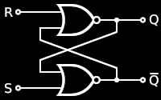
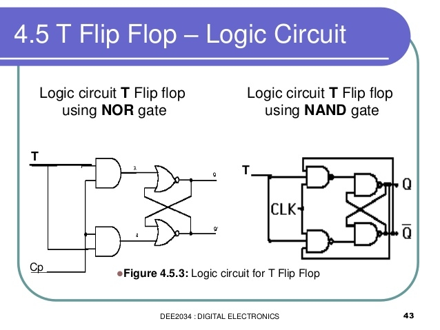

# Układy sekwencyjne
Układ sekwencyjny to **układ cyfrowy, w którym stan wyjścia zależy nie tylko od aktualnych wartości wejściowych, ale także od historii tych wejść (poprzednich stanów)**: zawiera on element pamiętający stan wewnętrzny. W przeciwieństwie do układów kombinacyjnych, układy sekwencyjne posiadają pamięć, dzięki czemu **przy takich samych sygnałach wejściowych mogą dawać różne wyniki w zależności od poprzedniego stanu.** 
Podstawowymi elementami budującymi układy sekwencyjne są *przerzutniki* (flip-flops) – bistabilne układy zdolne do **przechowywania pojedynczego bitu informacji.** 

## Przerzutnik
**Przerzutnik** (ang. *flip-flop*) jest to układ sekwencyjny bistabilny (o dwóch stanach stabilnych), **zdolny do przechowywania 1 bitu informacji**. Przerzutnik może zmieniać swój stan pod wpływem sygnałów wejściowych, przy czym wyróżniamy przerzutniki: 
- *asynchroniczne* - bez sygnału zegarowego - stan wyjścia zmienia się natychmiast po zmianie wejścia
- *synchroniczne* - z wejściem zegarowym - zmiana stanu następuje tylko w określonym momencie taktującym. Wśród przerzutników synchronicznych dodatkowo rozróżnia się wyzwalanie:
	- *zboczem* - narastającym lub opadającym sygnału zegara
	- *poziomem* - stanem wysokim lub niskim sygnału zegara 

Każdy przerzutnik synchroniczny posiada zazwyczaj:
- **wejście zegarowe** (CLK)
- jedno lub więcej **wejść danych** (informacyjnych)
- **wyjście główne** Q
- często **wyjście zanegowane** $\overline{Q}$. 
- Często spotyka się również asynchroniczne wejścia **ustawiające** (Set) i **zerujące** (Reset), które mają najwyższy priorytet i natychmiast wymuszają na wyjściu stan 1 (dla Set) lub 0 (dla Reset), niezależnie od zegara.

### Tabela przejść
**Tabela przejść** (tabela stanów) to **tabela opisująca zachowanie układu sekwencyjnego** – określa stan wyjścia (oraz ewentualnie stan wewnętrzny) w kolejnym takcie na podstawie bieżących sygnałów wejściowych i aktualnego stanu wewnętrznego układu. 
Tabela przejść pokazuje, jak przerzutnik przechodzi **z jednego stanu do drugiego w zależności od wartości na wejściach sterujących**. 
Tabelę przejść przerzutnika zazwyczaj przedstawia się w kolumnach:
- bieżący stan wyjścia $Q(t)$
- sygnały wejściowe
- następny stan $Q(t+1)$ (stan wyjścia po zadziałaniu układu).

Dla zobrazowania, poniżej przedstawiono przykład tabeli przejść dla **przerzutnika typu T**. Przerzutnik T posiada pojedyncze wejście $T$ oraz pamięta swój stan $Q$. Gdy $T=0$, przerzutnik zachowuje dotychczasowy stan (nie zmienia się). Natomiast gdy $T=1$, przerzutnik zmienia stan na przeciwny (następuje tzw. *toglowanie* stanu) podczas wyzwolenia sygnałem zegarowym. Tę zależność opisuje równanie $Q\_{next} = T \oplus Q$ (operacja XOR – wyjście zmienia się gdy $T=1$). Oto tabela przejść ilustrująca te zależności:

|  T  | Q(t) | Q(t+1) |
| :-: | :--: | :----: |
|  0  |   0  |    0   |
|  0  |   1  |    1   |
|  1  |   0  |    1   |
|  1  |   1  |    0   |

### Przebiegi czasowe
Działanie przerzutników (i ogólnie układów sekwencyjnych) można również przedstawić za pomocą **przebiegów czasowych**, czyli wykresów pokazujących zmiany stanów wejść i wyjść w funkcji czasu. Taka graficzna reprezentacja ukazuje zależności czasowe – np. momenty, w których przerzutnik próbkowany jest sygnałem zegarowym, opóźnienia propagacji, czasy narastania/opadania impulsów itp. Analiza przebiegów czasowych jest szczególnie istotna dla zrozumienia, *kiedy* następują zmiany stanu wyjść względem zmian wejść.

### Przerzutnik RS

**Przerzutnik RS (Set-Reset)** – jest to najprostszy rodzaj przerzutnika bistabilnego, zwykle realizowany jako latch asynchroniczny zbudowany z dwóch bramek NOR (lub równoważnie – z dwóch bramek NAND) sprzężonych zwrotnie. Posiada on dwa wejścia: $S$ (ang. *Set* – ustawiające) oraz $R$ (ang. *Reset* – zerujące), a także wyjście $Q$ i komplementarne $\overline{Q}$. Działanie przerzutnika RS podsumowuje tablica stanów:

|  S  |  R  |      $Q(t+1)$       |
| :-: | :-: | :-----------------: |
|  0  |  0  | $Q(t)$ (bez zmiany) |
|  0  |  1  |      0 (reset)      |
|  1  |  0  |       1 (set)       |
|  1  |  1  |  – *nieokreślony*   |

Przerzutnik RS **jako układ asynchroniczny zmienia stan wyjścia natychmiast po zmianie stanów wejść** (zakładając idealne bramki, pomijając niewielkie opóźnienia propagacji). Oznacza to, że nie posiada on dedykowanego wejścia zegarowego – jest wrażliwy na poziomy logiczne na $S$ i $R$ w każdym momencie. 

**Zastosowanie:** Przerzutnik RS sam w sobie bywa wykorzystywany np. jako prosty układ pamięciowy (latch) do przechowywania jednego bitu informacji, gdy nie jest wymagana synchronizacja zegarem. W wielu układach scalonych cyfrowych spotyka się przerzutniki RS w formie asynchronicznych wejść *Preset/Set* i *Clear/Reset* do ustawiania początkowego stanu przerzutników synchronicznych (jak wspomniano wcześniej, są to wejścia, które niezależnie od zegara wymuszają stan wyjścia na 1 lub 0).

### Przerzutnik T

**Przerzutnik T (toggle)** – przerzutnik, który przełącza swój stan przy każdym impulsie zegarowym, o ile na jego wejściu $T$ znajduje się stan wysoki (1). Gdy $T=0$, przerzutnik T zachowuje swój bieżący stan niezmieniony. Można powiedzieć, że wejście $T$ kontroluje, czy przerzutnik ma *zmienić* stan (gdy $T=1$) czy *pozostać* w tym samym stanie (gdy $T=0$) w momencie wyzwolenia. Tabela przejść przerzutnika T została już zaprezentowana wcześniej. Zgodnie z nią, jeżeli w chwili aktywnego zbocza zegara $Q(t)=0$ i $T=1$, to $Q(t+1)$ przyjmie stan 1; jeśli $Q(t)=1$ i $T=1$, to $Q(t+1)=0$ – następuje zmiana na przeciwny stan. Matematycznie, $Q(t+1) = Q(t) \oplus T$, co oznacza sumę modulo 2 stanu wejścia i poprzedniego stanu wyjścia.

### Przerzutnik D

**Przerzutnik D (Data lub Delay)** – jeden z najczęściej stosowanych typów przerzutników synchronicznych. Posiada pojedyncze wejście danych $D$ oraz wejście zegarowe (oznaczane zwykle $C$ lub CLK). Działanie przerzutnika D jest bardzo proste: **przepisuje on stan wejścia $D$ na wyjście $Q$ w momencie wystąpienia aktywnego zbocza sygnału zegarowego**, natomiast w pozostałych chwilach stan wyjścia pozostaje niezmieniony (zapamiętuje poprzednią wartość). W przerzutniku D wyzwalanym zboczem narastającym – najbardziej typowym – oznacza to, że **przy każdym narastającym zboczu zegara aktualna wartość logiczna sygnału $D$ zostanie zapamiętana i pojawi się na $Q$,** pozostając tam do czasu kolejnego zbocza narastającego. Tabela przejść przerzutnika D obrazuje, że następny stan $Q(t+1)$ jest po prostu równy wartości $D$ w chwili taktu, niezależnie od poprzedniego stanu $Q(t)$.

|  D  | Q(t) | Q(t+1) |
| :-: | :--: | :----: |
|  0  |   0  |    0   |
|  0  |   1  |    0   |
|  1  |   0  |    1   |
|  1  |   1  |    1   |

Przerzutniki D występują w dwóch odmianach: 
- jako **zatrzaski (latch)** – reagujące na poziom zegara (np. zapisujące $D$ na $Q$ gdy sygnał zegarowy ma stan wysoki i zatrzaskujące ten stan przy niskim poziomie),
- oraz jako **przerzutniki wyzwalane zboczem** – reagujące tylko na krótką chwilę zmiany stanu zegara (zbocze narastające lub opadające). 

Przerzutnik D typu latch można przekształcić w przerzutnik D wyzwalany zboczem, łącząc dwa zatrzaski D w układ master-slave (pierwszy zatrzask próbkowany np. stanem wysokim zegara, drugi – niskim, przez co cały układ przepuszcza zmianę tylko podczas przejścia stanu). W praktyce jednak projektanci układów cyfrowych zazwyczaj korzystają bezpośrednio z gotowych przerzutników D wyzwalanych zboczem, dostępnych w rodzinach układów logicznych TTL/CMOS i w architekturach układów programowalnych.

**Zastosowanie:** Przerzutnik D jest podstawowym elementem pamiętającym – *rejestrem 1-bitowym*. Łącząc równolegle kilka przerzutników D, można utworzyć rejestr przetrzymujący wielobitowe słowo. 
Przerzutniki D są też powszechnie wykorzystywane do realizacji opóźnień sygnałów (stąd nazwa *Delay flip-flop*), synchronizacji sygnałów asynchronicznych (jeden przerzutnik D opóźnia sygnał o jeden takt zegara, co pozwala na jego bezpieczne próbkowanie), a także do generowania podziałów częstotliwości. 
Przykładowo, **jeśli wyjście $\overline{Q}$ przerzutnika D połączymy z jego wejściem $D$, to utworzony zostanie dwójkowy dzielnik częstotliwości – układ ten będzie zmieniał stan na przeciwny przy każdym takcie** (jest to właśnie implementacja przerzutnika T), skutkiem czego na $Q$ otrzymamy przebieg o częstotliwości dwukrotnie mniejszej niż częstotliwość zegara. Kaskadowe połączenie takich układów (kilka przerzutników D połączonych w ten sposób szeregowo) daje asynchroniczny licznik binarny.

### Przerzutnik JK
**Przerzutnik JK** – jest to uniwersalny przerzutnik synchroniczny, posiadający dwa wejścia informacyjne: $J$ oraz $K$ (nazwane od inicjałów Jacka Kilby’ego, wynalazcy układów scalonych). Wejścia te stanowią uogólnienie wejść S i R przerzutnika RS – można je traktować jako wejście *ustawiające* ($J$) oraz *kasujące* ($K$) przerzutnik. Przerzutnik JK ma również wejście zegarowe (CLK) oraz wyjścia $Q$ i $\overline{Q}$, a często również asynchroniczne wejścia preset/reset (jak wspomniano wcześniej). 
Działanie przerzutnika JK łączy w sobie funkcjonalność innych typów przerzutników: **przy odpowiednich kombinacjach $J$ i $K$ może on zachowywać się jak przerzutnik RS, T lub D**. Jego zachowanie definiuje następująca tabela przejść:

|  J  |  K  | \$Q(t)\$ | \$Q(t+1)\$ | Opis działania              |
| :-: | :-: | :------: | :--------: | :-------------------------- |
|  0  |  0  |     0    |      0     | *Podtrzymanie* (bez zmiany) |
|  0  |  0  |     1    |      1     | *Podtrzymanie* (bez zmiany) |
|  0  |  1  |     0    |      0     | *Reset* (zerowanie do 0)    |
|  0  |  1  |     1    |      0     | *Reset* (zerowanie do 0)    |
|  1  |  0  |     0    |      1     | *Set* (ustawienie na 1)     |
|  1  |  0  |     1    |      1     | *Set* (ustawienie na 1)     |
|  1  |  1  |     0    |      1     | *Toggle* (zmiana 0→1)       |
|  1  |  1  |     1    |      0     | *Toggle* (zmiana 1→0)       |

- Gdy $J=0$ i $K=0$, niezależnie od dotychczasowego stanu $Q$, przerzutnik nie zmienia stanu (podtrzymuje go).
- Kombinacja $J=1, K=0$ powoduje **ustawienie** przerzutnika – wyjście $Q$ przechodzi do stanu wysokiego (1).
- Kombinacja odwrotna $J=0, K=1$ wywołuje **wyzerowanie** – wyjście $Q$ przyjmuje stan niski (0).
-  $J=1, K=1$: w tej sytuacji przy kolejnym takcie zegara następuje **toglowanie** stanu – przerzutnik JK zmienia stan na przeciwny (z 0 na 1 lub z 1 na 0). Warto zauważyć, że w odróżnieniu od przerzutnika RS, kombinacja obu aktywnych wejść ($J=1, K=1$) **nie jest zabroniona**, lecz powoduje określoną, jednoznaczną akcję (przełączenie stanu). Dzięki temu przerzutnik JK nie ma nieokreślonych stanów – jest to jeden z powodów jego popularności.

Przerzutnik JK jest z definicji przerzutnikiem **synchronicznym** – reaguje na kombinację stanów $J$ i $K$ tylko w momencie aktywnego zbocza sygnału zegarowego (poza tymi momentami zmiany na wejściach nie wpływają na wyjścia). W praktyce układy JK były często realizowane jako przerzutniki master-slave wyzwalane zboczem opadającym.

**Zastosowanie:** Przerzutnik JK był historycznie ceniony za swoją wszechstronność – potrafi realizować funkcje innych przerzutników, przez co dawniej używano go np. w realizacji liczników (przez odpowiednie sprzężenie wyjść z wejściami można konstruować liczniki modulo-n na bazie JK). Jednak konfiguracja wejść $J,K$ dla uzyskania żądanego działania bywa mniej intuicyjna niż użycie prostszego przerzutnika D lub T, dlatego we współczesnych układach scalonych przerzutniki JK są rzadziej bezpośrednio wykorzystywane. 

### Przerzutnik JK-MS
**Przerzutnik JK-MS (Master-Slave)** – jest to odmiana przerzutnika JK zbudowana z **dwóch przerzutników JK połączonych kaskadowo w układzie master-slave**. 
- **master (nadrzędny)** – pełni funkcję bufora wejściowego i próbkowany jest bezpośrednio sygnałem zegarowym. 
- **slave (podrzędny)** – jest buforem wyjściowym i otrzymuje sygnał zegarowy odwrócony (przesunięty w fazie o pół okresu) względem master.

Dzięki takiej organizacji, informacja podawana na wejścia $J, K$ zostaje najpierw zapisana w przerzutniku master w chwili aktywnego (np. narastającego) zbocza zegara, ale **wyjście z układu nie zmienia się od razu – dopiero gdy pojawi się przeciwne (np. opadające) zbocze zegara, stan zapamiętany w masterze zostaje przeniesiony do przerzutnika slave, a tym samym na wyjście $Q$**. W efekcie przerzutnik JK-MS zmienia swój stan wyjściowy tylko **raz na cykl zegara** (przy jednym ze zboczy), niezależnie od tego, jak długo sygnał zegarowy pozostaje w stanie aktywnym. Rozwiązuje to problem tzw. *race-around* obecny w prostym przerzutniku JK – czyli niepożądanych wielokrotnych przełączeń wyjścia podczas długotrwałego poziomu zegara przy $J=K=1$. Przerzutnik JK-MS zachowuje się z punktu widzenia użytkownika jak przerzutnik JK wyzwalany konkretnym zboczem (np. opadającym, jeśli master próbkowany jest zboczem narastającym), jednak wewnętrznie jest to układ dwuetapowy.

## Rejestr
**Rejestr** to układ elektroniczny zbudowany z grupy przerzutników bistabilnych, służący do przechowywania *wielobitowej* informacji (ciągu bitów). 
- Typowy rejestr składa się z $n$ przerzutników, co pozwala mu pamiętać $n$-bitowe słowo binarne – mówimy wtedy o rejestrze $n$-bitowym.
- Rejestr stanowi zatem bardzo małą, szybką pamięć cyfrową, zdolną do tymczasowego przechowywania danych (np. liczb, kodów, wyników obliczeń) wykorzystywanych wewnątrz systemu cyfrowego. 

Przykładowo, w mikroprocesorach i mikrokontrolerach występują liczne rejestry wykorzystywane do przechowywania danych i wyników operacji – są to najszybsze (choć o najmniejszej pojemności) elementy pamięci systemu.

Rodzaje rejestrów można klasyfikować na podstawie sposobu załadowania i odczytania danych. Wyróżnia się cztery podstawowe typy rejestrów:
* **Rejestr równoległy-równoległy** (ang. *parallel-in parallel-out*) – posiada $n$ wejść i $n$ wyjść równoległych. Całe $n$-bitowe słowo jest jednocześnie (równolegle) zapisywane do rejestru i jednocześnie odczytywane na wyjściach. Taki rejestr służy do przechowywania danych dostępnych w formie równoległej (wszystkie bity naraz).
* **Rejestr szeregowy-szeregowy** (ang. *serial-in serial-out*) – dane są wprowadzane do rejestru **bit po bicie** (szeregowo, np. na pojedyncze wejście) i w ten sam sposób odczytywane szeregowo z jednego wyjścia. Tego typu rejestr pełni funkcję **rejestru przesuwnego** (*shift register*) – **każdy impuls zegara przesuwa zawartość rejestru o jeden bit**, umożliwiając wpuszczenie nowego bitu na jednym końcu i odczyt bitu wyższego rzędu na drugim końcu.
* **Rejestr równoległy-szeregowy** (ang. *parallel-in serial-out*) – rejestr, do którego równolegle wpisujemy $n$-bitowe słowo (**wszystkie bity na raz**), ale odczyt następuje szeregowo (**bit po bicie**). Taki rejestr może służyć np. do konwersji równoległej danej na formę szeregową (serializację).
* **Rejestr szeregowy-równoległy** (ang. *serial-in parallel-out*) – dane są wprowadzane szeregowo (np. w takt zegara), natomiast później cała zawartość rejestru jest dostępna na wyjściach równoległych jednocześnie. To przeciwieństwo poprzedniego przypadku – rejestr tego typu może pełnić funkcję deserializatora (konwersja strumienia bitów na równoległy format).
- W praktyce spotyka się także **rejestry uniwersalne**, które mogą działać w różnych trybach (mają przełączane tryby równoległe/szeregowe, umożliwiają zarówno przesuwanie, jak i równoległy zapis/odczyt). 

**Zastosowanie:** Rejestry są wykorzystywane wszędzie tam, gdzie zachodzi potrzeba krótkotrwałego przechowania danych i ewentualnego ich przesuwania lub transferu. Wykorzystuje się je m.in. do:
- **przesuwania bitów** (np. mnożenie i dzielenie przez 2 w układach arytmetycznych realizuje się przez przesunięcia bitowe w rejestrach),
- **buforowania danych** pomiędzy podsystemami (np. tymczasowe przechowanie bajtu odebranego szeregowo, zanim zostanie przetworzony), 
- **konwersji formatu danych** (rejestry szeregowo-równoległe i odwrotne do zmiany formy przesyłania danych). 

W mikrokontrolerach rejestry przesuwne są używane np. w sprzętowych modułach SPI/UART do zamiany danych między formą szeregową a równoległą przy komunikacji. Rejestry równoległe z kolei stanowią podstawę budowy liczników i pamięci tymczasowych (np. licznik programowy, akumulatory, rejestry wyników itp. wewnątrz procesora są zrealizowane właśnie jako rejestry zbudowane z przerzutników D).

## Licznik
**Licznik** to układ sekwencyjny, którego funkcją jest zliczanie impulsów (sygnałów taktujących) pojawiających się na jego wejściu zliczającym oraz pamiętanie bieżącej *liczby* tych impulsów (najczęściej w postaci binarnej). 
- Licznik przechodzi kolejno przez pewien ustalony ciąg stanów w odpowiedzi na kolejne impulsy zegarowe, reprezentując w swoich wyjściach (np. w postaci kilku bitów $Q\_0...Q\_{n-1}$) liczbę impulsów, które naliczono. 
- Najprostszy licznik może zliczać wprost w kodzie binarnym (naturalnym) od 0 wzwyż – wtedy po każdym impulsie wartość binarna na wyjściach zwiększa się o jeden. Bardziej złożone liczniki mogą zliczać w dół, w górę i w dół (rewersyjne), lub według dowolnej sekwencji stanów (np. liczniki w nietypowych kodach, liczniki pseudolosowe itp.), jednak binarny licznik prosty jest najczęściej omawianym przypadkiem.

**Budowa:** Liczniki realizuje się z wykorzystaniem przerzutników jako podstawowych elementów pamiętających poszczególne bity stanu. Przerzutniki te muszą być odpowiednio połączone, aby po każdym impulsie generować następny stan liczbowy. 
W wielu klasycznych układach liczniki budowano z przerzutników JK pracujących w trybie T (czyli z połączonymi wejściami $J=K=1$, co daje przełączenie przy każdym takcie). Jeśli połączymy $n$ takich przerzutników szeregowo (wyjście $Q$ jednego do wejścia zegarowego następnego), otrzymamy prosty **licznik asynchroniczny** (tzw. licznik szeregowy lub *ripple counter*). W liczniku asynchronicznym pierwszy przerzutnik otrzymuje sygnał zegarowy, a każdy kolejny – wyjście poprzedniego przerzutnika, wskutek czego zmiany stanów kolejnych bitów następują z pewnym opóźnieniem (fala przełączeń *rippluje* przez kolejne przerzutniki). Taka struktura jest bardzo prosta (wymaga minimalnej dodatkowej logiki), ale ma wadę w postaci narastających opóźnień wraz z liczbą bitów – wyjścia wyższych bitów zmieniają się później niż niższych. 
Rozwiązaniem tego problemu są **liczniki synchroniczne (równoległe)**, w których wszystkie przerzutniki otrzymują wspólny sygnał zegarowy (są taktowane jednocześnie), a dodatkowa kombinacyjna sieć logiczna dba o to, by w momencie taktu każdy przerzutnik przyjął właściwy stan (odpowiadający zwiększeniu lub zmniejszeniu licznika). Liczniki synchroniczne są bardziej złożone w budowie (wymagają zaprojektowania logiki wzbudzeń dla przerzutników), ale ich bity zmieniają się jednocześnie, przez co eliminują problem rozchodzącego się opóźnienia i mogą pracować z wyższymi częstotliwościami zegara.

**Charakterystyki liczników:** Gdy licznik składa się z $n$ przerzutników, to zazwyczaj może on reprezentować $2^n$ różnych stanów. Maksymalna liczba impulsów, jaką licznik potrafi zliczyć zanim nastąpi przepełnienie (powrót do zera), nazywana jest **pojemnością licznika** $P$ – dla licznika $n$-bitowego wynosi ona $P = 2^n$. Zapełnienie licznika (osiągnięcie stanu maksymalnego) powoduje, że przy następnym impulsie licznik wraca do stanu początkowego (najczęściej 0) i rozpoczyna zliczanie od początku. 
Długością *cyklu pracy* licznika określamy liczbę rozróżnialnych stanów, przez jakie licznik przechodzi cyklicznie – tę wielkość oznaczmy $S$. Dla większości liczników $S = P$, jednak istnieją liczniki, które nie wykorzystują wszystkich kombinacji stanów swoich przerzutników – wtedy $S < 2^n$. Mówimy wówczas o **liczniku modulo-$S$**. Przykładem jest licznik dziesiętny (tzw. dekadowy) zliczający od 0 do 9 – ma on $n=4$ przerzutniki (teoretycznie zdolne reprezentować 16 stanów 0–15), lecz wykorzystuje tylko 10 pierwszych stanów, po czym następuje reset do zera. Taki układ jest licznikiem modulo-10 ($S=10$, $P=16$). Realizuje się go zwykle dodając dodatkową bramkę kombinacyjną wykrywającą stan "1010" (10 w kodzie binarnym) i zerującą licznik asynchronicznie, co powoduje skrócenie cyklu do 10 stanów.

**Licznik rewersyjny:** Wiele praktycznych liczników potrafi zliczać w obu kierunkach – w górę (increment) i w dół (decrement). Realizuje się to poprzez odpowiednie sterowanie wejść przerzutników w zależności od trybu pracy (np. dodanie sieci logicznej, która w trybie zliczania w dół powoduje odwrócenie pewnych sygnałów). Liczniki up/down mogą posiadać wejście kierunku zliczania, które decyduje, czy przy takcie wartość liczby rośnie czy maleje.

**Zastosowanie:** Liczniki należą do podstawowych układów sekwencyjnych o bardzo szerokim zastosowaniu. Powszechnie wykorzystuje się je:
- do **pomiaru częstotliwości i podziału częstotliwości** (np. licznik mod-$n$ zliczający impulsy zegarowe posłuży do wygenerowania sygnału o częstotliwości *zegar/$n$*)
- w **zegarch cyfrowych** (odmierzanie sekund, minut, godzin – liczniki dziesiętne i mieszanego modułu)
- **układach sterujących** (zliczanie kroków sekwencji sterującej, adresowanie kolejnych instrukcji – licznik programowy)
- jako elementy **układów arytmetycznych** (np. liczniki używane jako rejestry sumujące przy dodawaniu binarnym). 

W technice mikrokontrolerów liczniki pojawiają się wewnątrz układów w postaci **timerów** – są to liczniki sprzężone z sygnałem zegara systemowego, które odliczają impulsy i pozwalają w ten sposób mierzyć upływ czasu lub generować opóźnienia.
Każdy mikrokontroler posiada też *licznik programowy* (program counter) wskazujący adres aktualnie wykonywanej instrukcji; jest on automatycznie inkrementowany i stanowi kluczowy element sekwencyjnej pracy procesora.