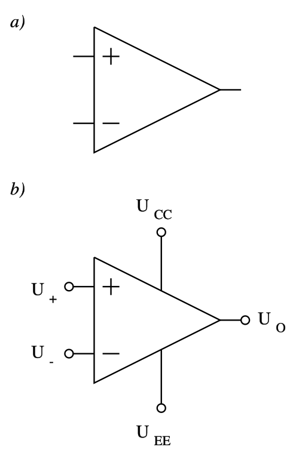
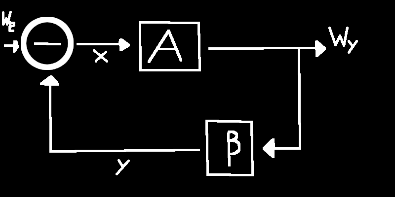

# Wzmacniacz operacyjny

## Układ scalony
Element elektryczny, w którym wszystkie komponenty wykonane są na jednym kawałku krzemu.

## Wzmacniacz różnicowy
**Wzmacniacz dwuwejściowy** zbudowany z dwóch tranzystorów pracujących w układzie wspólnego emitera, mających wspólny obwód emiterowy, w najprostszym przypadku rezystor. Rezystor ten stabilizuje punkty pracy obu tranzystorów i wymusza prąd płynący we wspólnym obwodzie, który jest równy sumie prądów obu tranzystorów. Przy dużej rezystancji prąd nie zależy od natężeń prądów na wejściach.
**Napięcie wyjściowe wzmacniacza różnicowego jest zależne od różnicy napięć pomiędzy jego wejściami**. 

## Wzmacniacz operacyjny
Wielostopniowy wzmacniacz różnicowy prądu stałego charakteryzujący się bardzo dużym różnicowym wzmocnieniem napięciowym i przeznaczony zwykle do pracy z zewnętrznym obwodem sprzężenia zwrotnego, który decyduje o głównych właściwościach całego układu (zob. też wzmacniacz ze sprzężeniem zwrotnym). 
- Wzmacniacz napięcia stałego.
- Układ scalony
	- V+, V-, Vout
	- Z napięcia zasilania
- Sprzężenie zwrotne

### Symbol

- Wejście nieodwracające +
- Wejście odwracające -
- Wzmocnienie $A_{OL}$ w otwartej pętli
- Napięcie wyjść $U_O=A_{OL}\cdot(U^+-U^-)$

### Schemat zastępczy

## Wzmacniacz idealny
- $R_{we}=\infty$
	- $I_{we}=0$
- $R_{wyjść} = 0$
	- idealne źródło napięciowe
- Wzmocnienie $A_{OL}=\infty$

## Sprzężenie zwrotne
Doprowadzenie do wejścia układu części sygnału wyjściowego.
- ujemne sprzężenie
- dodatnie sprzężenie

Poprawienie parametrów całego układu
- zmniejszenie zniekształceń
- zwiększenie pasma przenoszenia
## Ujemne sprzężenie zwrotne

- $Wy=A\cdot x$
- $x = We-y$
- $y = \beta \cdot Wy$
- $\frac{Wy}{We}=\frac{A}{1+A\cdot\beta} \rightarrow \frac{1}{\beta}$
**Wniosek**:Wzmocnienie układu ze wzmacniaczem operacyjnym i ujemnym sprzężeniem zwrotnym nie zależy od samego wzmacniacza ($A_{OL}\rightarrow\infty$) a jedynie od zewnętrznych elementów.

## Zasada działania
Wzmacniacz dąży do tego, aby w układzie różnica napięć na wejściu wzmacniacza wynosiła zero.

## Wzmacniacz odwracający

## Wzmacniacz nie odwracający

## Sumator

## Wzmacniacz różnicowy

## Komparator

## Wzmacniacz całkujący

## Wzmacniacz różniczkowy

## Wzmacniacz logarytmiczny

## Transformata Laplace'a

## Widmo