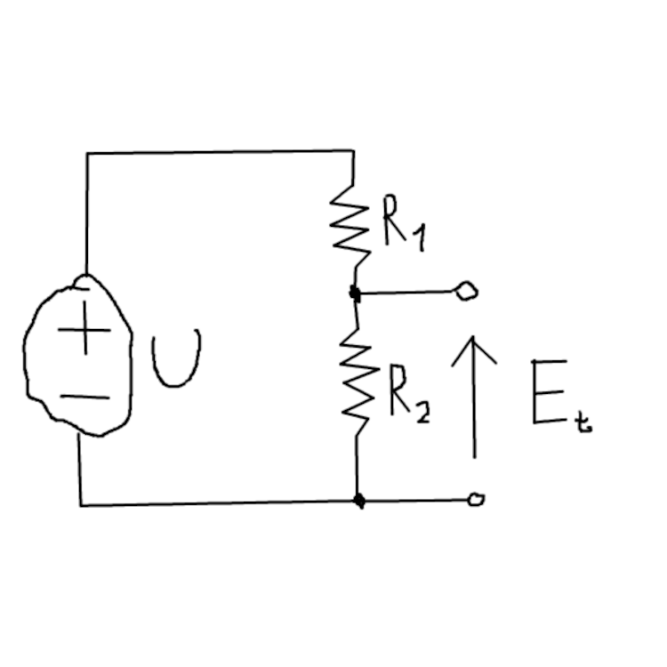
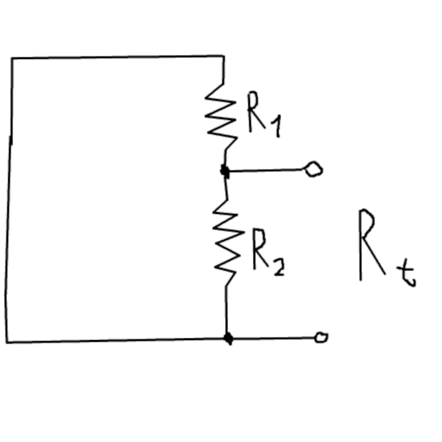

# Zasada Thevenina
> Stacjonarny, liniowy i skupiony **obwód elektryczny można zastąpić obwodem złożonym z idealnego źródła napięcia** (źródło Thevenina) **oraz impedancji** (rezystora w obwodach prądu stałego).

## Napiecie Thevenina
$$E_t = \frac{U}{R_1+R_2}\cdot R_2$$

## Prad Thevenina
Zastepuje zrodlo pradu rozwarciem
$$I_t = \frac{U}{R_1}$$

## Rezystancja Thevenina
Zastepuje zrodlo napiecia zwarciem
$$R_t=\frac{U_t}{I_t}$$
$$R_t=\frac{R_1\cdot R_2}{R_1+R_2}$$
