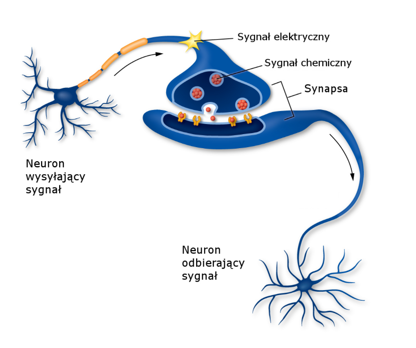
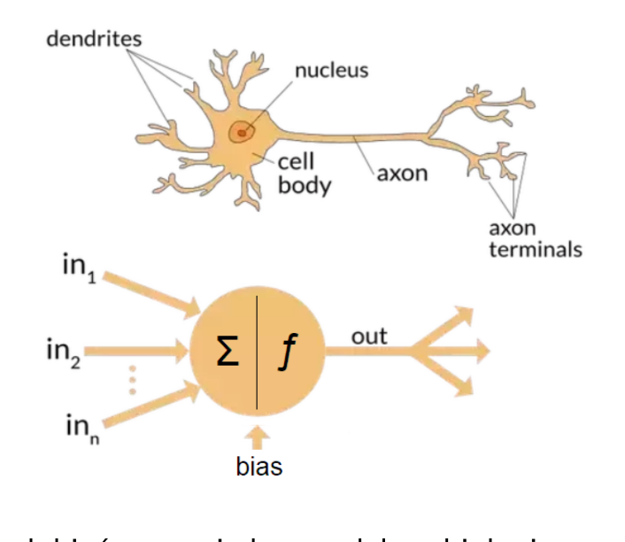
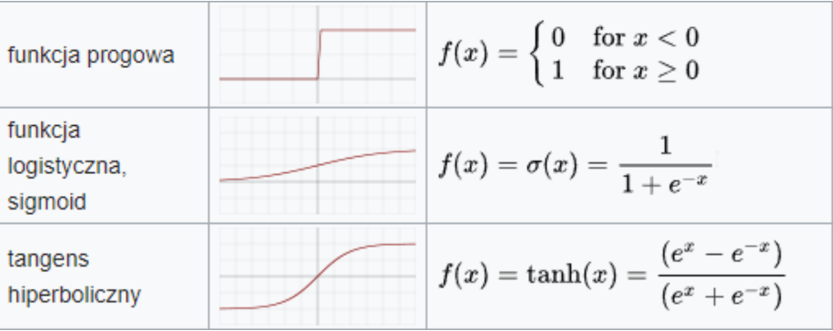

# Sieci neuronowe
Sztuczne sieci neuronowe bazują na biologicznych odpowiednikach: **neuronach** i **mózgach**.

1. Neuron otrzymuje dostatecznie **silny bodziec** na dendrytach.
2. Dochodzi do wytworzenia potencjału czynnościowego (polaryzacja błony neuronu)
3. Potencjał czynnościowy jest stały dla neuronu (nie może wytwarzać silniejszych potencjałów).
4. Impuls dociera do zakończeń aksonu.
5. **Sygnał elektryczny pobudza wydzielanie neuroprzekaźników w synapsie.** One wywołują **sygnał elektryczny w kolejnym neuronie.**

## Sztuczna sieć neuronowa
Sztuczna sieć neuronowa, w ujęciu matematyczno-informatycznym, to **graf skierowany, z wagami na krawędziach i o specyficznej warstwowej strukturze.** 
- **Warstwa wejściowa** (Input layer) zawiera neurony, które pobierają sygnały/bodźce/dane z zewnątrz.
- **Warstwy ukryte** (hidden layers) przetwarzają te sygnały.
- **Warstwa wyjściowa** (output layer) zwraca dane wyjściowe/wyniki.

1. Neuron **dostaje dane liczbowe** (imitacja sygnałów elektrycznych), **mnoży** przez wagi na krawędziach i **sumuje**.
2. Następnie suma przetwarzana jest przez tzw. **funkcję aktywacji** f(n)
3. Tak obliczona liczba jest **przekazywana** do kolejnej warstwy (propagowanie sygnału, forward propagation)
Potencjał czynnościowy neuronu biologicznego jest ograniczony przez pewien zakres. **Funkcja aktywacji** f(n) to **”ogranicznik”** dla modelu matematycznego. Jej wartości są z wąskiego zakresu, często [−1, 1] lub [0, 1].

### Schemat działania
Sieci neuronowe w praktyce **same konstruują potrzebne użytkownikowi modele**, ponieważ automatycznie uczą się na podanych przez niego przykładach. 
1. użytkownik sieci gromadzi **reprezentatywne dane** 
2. uruchamia **algorytm uczenia**, który ma na celu wytworzenie w pamięci sieci potrzebnej struktury (modelu) 
3. wyuczona sieć realizuje wszystkie potrzebne funkcje związane z eksploatacją wytworzonego modelu

### Zalety sieci neuronowych
- Potrafią odpowiadać w warunkach informacji niepełnej
- Nie wymagają znajomości algorytmu rozwiązania zadania (automatyczne uczenie)
- Przetwarzają informację w sposób wysoce równoległy
- Potrafią generalizować (uogólniać na przypadki nieznane)
- Są odporne na częściowe uszkodzenia
- Potrafią realizować pamięć asocjacyjną (skojarzeniową – podobnie jak działa pamięć u ludzi) w przeciwieństwie do pamięci adresowanej (charakterystycznej dla klasycznych komputerów)
- Duża moc (nieliniowych charakter)

### Rodzaje sieci neuronowych
- perceptron - sieć z jednym neuronem
- klasyczna sieć jednokierunkowa (ta, której dotyczy ta definicja)
- sieć rekurencyjna
- sieć modularna

### Zastosowania
- Rozpoznawanie twarzy, obiektów (rozpoznawanie wzorców).
- Dane medyczne: stawianie diagnozy.
- Prognozowanie: giełda, sprzedaż.
- Aproksymacje funkcji.
- Rozpoznawanie pisma (OCR), mowy, gestów.
- Gry i rozwiązanie problemów (szachy).

## Uczenie sieci: algorytm wstecznej propagacji

### Gradient
Gradient to **pole wektorowe dla funkcji liczbowej.** W każdym punkcie dziedziny funkcji zaczepiamy strzałkę wskazującą, w którą stronę funkcja rośnie/maleje i jak szybko się to dzieje. Matematycznie można go rozumieć jako **zestaw pochodnych cząstkowych.**
- Przykład: dla funkcji $f(x, y, z)=2x-3y^2-sinz$ jest $\nabla f=[\frac{\partial f}{\partial x}, \frac{\partial f}{\partial y}, \frac{\partial f}{\partial z}] = [2, -6y, -cosz$

### Funkcja straty
W przypadku sieci, funkcja f , którą chcemy zminimalizować (patrząc na jej gradient), to **funkcja błędu / straty** (ang. loss function). Zwykle wybiera się funkcję **MSE** (Mean Squared Error) lub **Cross Entropy**.
Funkcja MSE porównuje przewidywany output z prawdziwym outputem dla jednej próbki (te dwa wektory są jej argumentami).
- $MSE(output_{pred}, output_{real}) = \sum_i \frac{(output_{pred}^i - output_{real}^i)^2}{n}$

W trenowaniu sieci poprawiamy jednak wagi W w sieci. Należy zdefiniować więc funkcję straty następująco, z innym argumentem:
- $Loss_{input}(W)=MSE(ForwardProop_w(input), output_{real})$

dla pewnej próbki input.
W praktyce bierzemy też często większy zestaw próbek (tzw. batch, ale o tym później) i obliczamy średnią funkcję:
- $Loss_{batch}(W)=\sum_{input\in batch}\frac{MSE(ForwardProp_w(input), output_{real}}{|batch|}$

### Spadek (wzdłuż) gradientu
Jak szukać minimum dla funkcji straty? Trzeba poruszać się w kierunku minimum, patrząc na pochodne cząstkowe (czyli gradient funkcji). Służy do tego procedura zwana **spadkiem (wzdłuż) gradientu** (ang. **gradient descent**). Algorytm działa w krokach -iteracjach.

### Wsteczna propagacja
Wsteczna propagacja (ang. back propagation) to **sposób uczenia sieci**, który idzie **od warstwy wyjściowej, ”w lewo”, do warstwy wejściowej poprawiając wagi**. Poprawianie każdej z wagi następuje poprzez **spadek gradientu** dla niej.
Algorytm dąży do minimalizacji błędu popełnianego przez sieć (minimalizacja funkcji straty, loss function). Ogólny schemat:
1. Zainicjalizuj sieć z losowymi wagami (random **W** )
2. Wybierz próbkę (lub batch) danych ze zbioru treningowego. Oblicz wartości wyjściowe sieci dla próbki (dla **input** obliczamy $output_{pred}$ )
3. Oblicz błąd sieci (np. **MSE** porównujące $output_{pred}$ i $output_{real}$)
4. Popraw wagi W poprzez propagację wsteczną błędu (minimalizujemy **Loss(W)**)
5. Czy sieć nauczona? Czy upłynęło max epok?
	- TAK – KONIEC
	- NIE – wróć do punktu 2